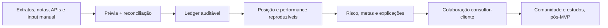
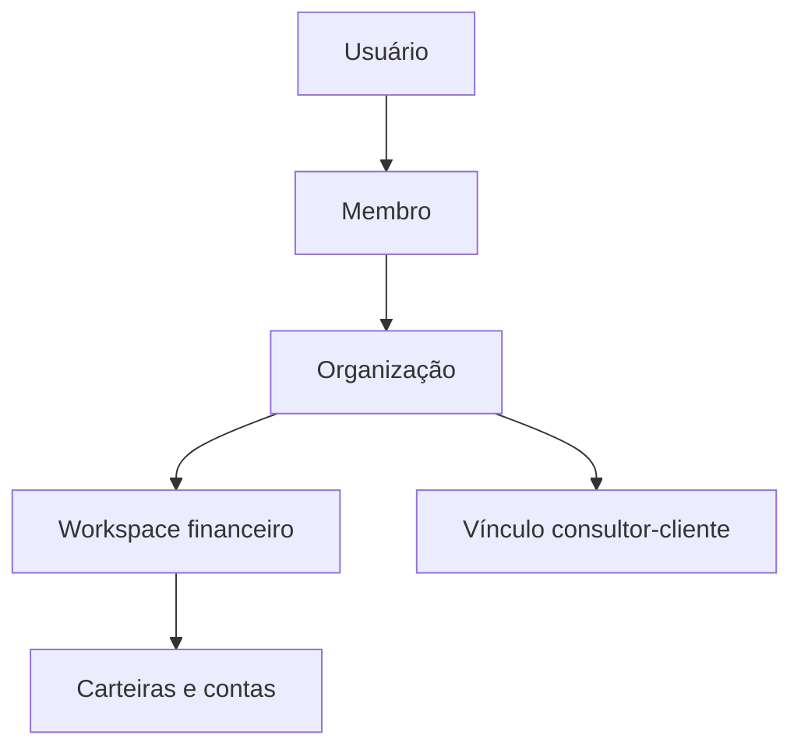
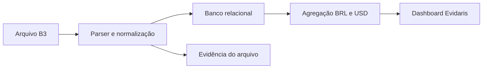
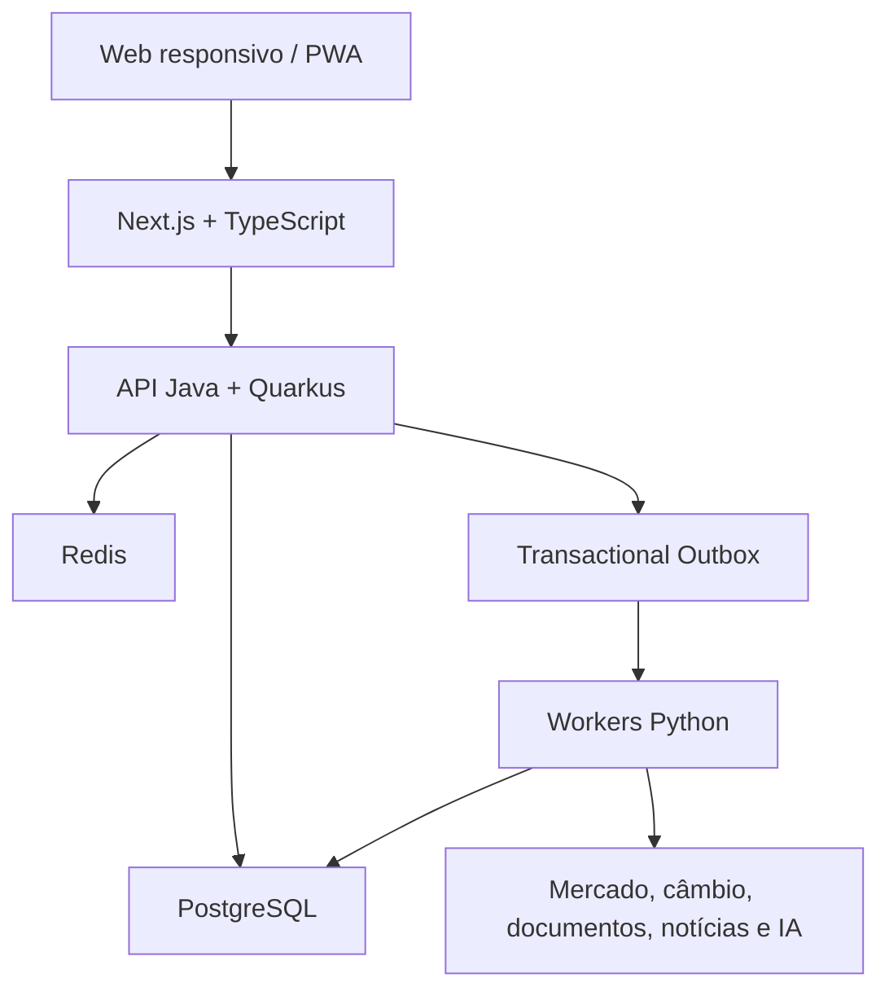
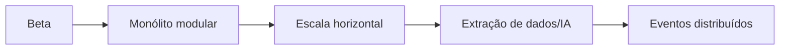
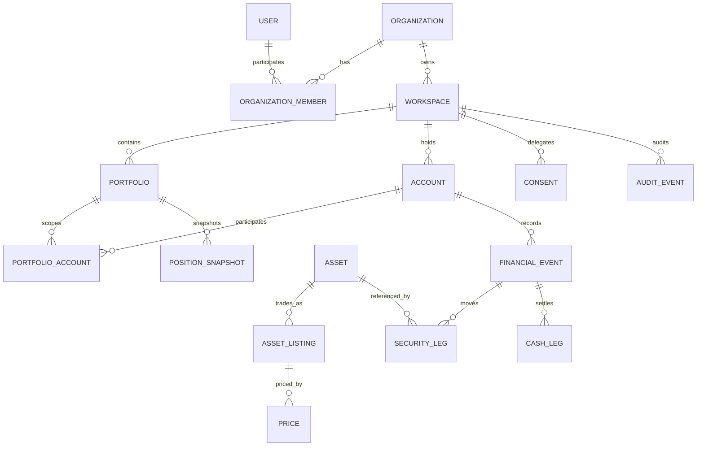
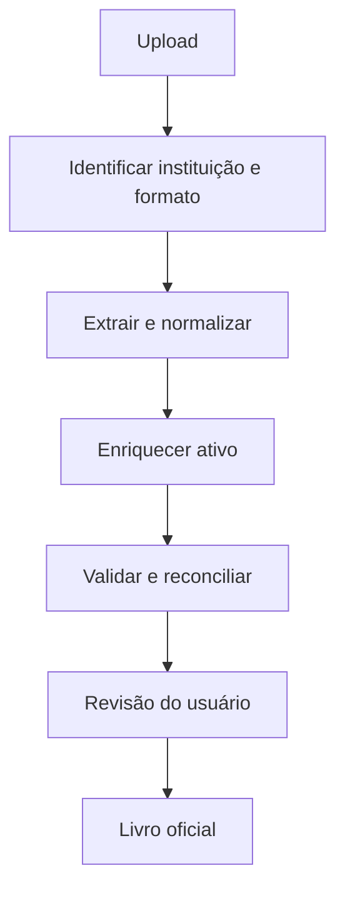

# Evidaris — Plataforma Global de Inteligência Patrimonial

> **Status:** arquitetura e descoberta do produto  
> **Versão do documento:** 0.6.0  
> **Data de referência:** 31/08/2026  
> **Visibilidade pretendida:** repositório privado  
> **Nome comercial:** `Evidaris` — aprovado pelos fundadores

Plataforma web para consolidar, acompanhar e explicar investimentos mantidos em diferentes instituições, moedas e classes de ativos. O produto nasce como um beta para o fundador e convidados, mas deve evoluir sem reescrita estrutural para organizações, consultores, clientes e mais de 100 mil usuários.

O sistema não executará ordens nem recomendará investimentos. Seu papel será organizar dados, calcular desempenho e risco, explicar exposições, acompanhar teses definidas pelo próprio usuário e apresentar notícias relevantes com fontes.

### Entrega 0.1 — call de 31/08/2026

Foi aprovado um *thin slice* funcional para transformar a visão arquitetural em um produto demonstrável sem antecipar toda a infraestrutura definitiva:

- dashboard responsivo inspirado no molde aprovado;
- importação de posição da Área do Investidor B3 em XLSX, XLS ou CSV;
- normalização de cabeçalhos e valores monetários brasileiros;
- prevenção de duplicidade por hash SHA-256 do arquivo;
- persistência do lote, posições normalizadas e evidência original;
- patrimônio total em BRL e USD com câmbio de referência explicitado;
- distribuição por classe, instituições e maiores posições;
- assistente de IA flutuante demonstrativo, ainda sem modelo conectado;
- arquivo demonstrativo para validar a jornada sem dados reais.

Esta entrega prova o caminho `arquivo B3 → normalização → banco → patrimônio`. Ela ainda não promete histórico transacional completo, TWR, XIRR, conciliação de movimentações, cotações automáticas ou leitura de screenshots.

---

## Sumário

1. [Problema](#problema)
2. [Proposta de valor](#proposta-de-valor)
3. [Marca e identidade visual](#marca-e-identidade-visual)
4. [Mercado e benchmark competitivo](#mercado-e-benchmark-competitivo)
5. [Necessidades do investidor pequeno e médio](#necessidades-do-investidor-pequeno-e-médio)
6. [Segmentação e personas prioritárias](#segmentação-e-personas-prioritárias)
7. [Estratégia de diferenciação e geração de valor](#estratégia-de-diferenciação-e-geração-de-valor)
8. [Modelo freemium e hipóteses de preço](#modelo-freemium-e-hipóteses-de-preço)
9. [Oportunidade B2B e consultorias](#oportunidade-b2b-e-consultorias)
10. [Princípios do produto](#princípios-do-produto)
11. [Escopo do MVP](#escopo-do-mvp)
12. [Usuários, organizações e papéis](#usuários-organizações-e-papéis)
13. [Arquitetura](#arquitetura)
14. [Stack tecnológica](#stack-tecnológica)
15. [Domínios do sistema](#domínios-do-sistema)
16. [Modelo de dados conceitual](#modelo-de-dados-conceitual)
17. [Regras de negócio](#regras-de-negócio)
18. [Cálculos financeiros](#cálculos-financeiros)
19. [Renda fixa e crédito privado](#renda-fixa-e-crédito-privado)
20. [Importação B3, XP e PicPay](#importação-b3-xp-e-picpay)
21. [Cotações, moedas e calendários](#cotações-moedas-e-calendários)
22. [Dashboards e experiência](#dashboards-e-experiência)
23. [IA, notícias e limites regulatórios](#ia-notícias-e-limites-regulatórios)
24. [Segurança, privacidade e auditoria](#segurança-privacidade-e-auditoria)
25. [Roadmap](#roadmap)
26. [Custos do beta](#custos-do-beta)
27. [Critérios de qualidade](#critérios-de-qualidade)
28. [Decisões arquiteturais](#decisões-arquiteturais)
29. [Questões em aberto](#questões-em-aberto)
30. [Fontes e referências](#fontes-e-referências)

---

## Problema

O investidor que mantém recursos em mais de uma corretora precisa lidar com:

- posições fragmentadas;
- moedas e bolsas diferentes;
- preços médios calculados de formas pouco transparentes;
- extratos e notas em formatos incompatíveis;
- necessidade de cadastrar manualmente cada movimentação;
- dificuldade para separar retorno do ativo, câmbio, dividendos e custos;
- pouca visibilidade de concentração, liquidez e risco;
- notícias genéricas que não consideram sua carteira;
- ausência de histórico confiável das razões que motivaram cada posição.

As corretoras mostram seus próprios produtos e saldos. A plataforma deverá mostrar o patrimônio do usuário de forma independente da instituição distribuidora.

## Proposta de valor

> Consolidar automaticamente uma carteira global, explicar o que mudou e por quê, medir retorno e risco com metodologia transparente e preservar o controle do usuário sobre seus próprios dados.

### Diferenciais pretendidos

- moeda principal em USD, com visualização alternativa em BRL, EUR e GBP;
- suporte correto a ativos, listagens, bolsas, ISINs e moedas de negociação;
- importação assistida de documentos e extratos;
- TWR em evidência e XIRR para a experiência real do investidor;
- separação de valorização, câmbio, dividendos, taxas e impostos informados;
- duas visões de custo médio;
- risco detalhado e explicado em linguagem clara;
- marcação a mercado ou valor modelado com fonte e confiança explícitas;
- IA fundamentada em posições, teses e fontes verificáveis;
- futura conexão entre consultores e clientes por consentimento e papéis;
- exportação integral dos dados do usuário.

## Marca e identidade visual

> **Status:** `Evidaris` foi aprovado como nome oficial. Slogan e direção visual estão aprovados como base de trabalho; registro de marca, domínios e validação jurídica permanecem como gates obrigatórios antes do lançamento público.

### Briefing aprovado

| Dimensão | Direção |
|---|---|
| Relação institucional | Marca totalmente independente da FUP Implementações |
| Abrangência | Nome internacional, abstrato e pronunciável em português e inglês |
| Significado | Deve possuir uma história coerente, não ser apenas combinação aleatória de letras |
| Valor emocional | Confiança e segurança |
| Expressão | Institucional, sofisticada e contemporânea |
| Atenção visual | Cores de alto contraste que despertem curiosidade sem parecer trading, cassino ou cripto especulativa |
| Longevidade | Deve atender B2C popular e, futuramente, consultorias e clientes de maior patrimônio |
| Arquitetura de marca | Uma marca principal com produtos e planos subordinados; evitar nova marca para cada módulo |

### Território verbal

A marca deverá comunicar quatro ideias:

1. **verdade verificável:** cada número pode ser conferido;
2. **patrimônio unificado:** partes fragmentadas formam uma visão coerente;
3. **orientação sem prescrição:** clareza para decidir, sem recomendação disfarçada;
4. **confiança global:** instituições, classes e moedas diferentes sob a mesma metodologia.

Palavras que podem inspirar o sistema verbal: evidence, clarity, trust, whole, verified, vantage, balance, view e control.

Palavras e clichês a evitar no nome: bank, trade, profit, rich, alpha, easy money, bull, crypto, capital e expressões que prometam ganho.

### Histórico da exploração de naming

A triagem abaixo é preliminar e baseada em busca pública exploratória. Não substitui busca de anterioridade no INPI, análise jurídica, registro de domínio ou verificação de marcas em outros países.

| Nome | Construção e significado | Força | Risco preliminar |
|---|---|---|---|
| **Evidaris** — recomendado | `evidence` + referência conceitual a Polaris: evidência que orienta | Alinha diretamente confiança, auditabilidade e direção; sofisticado e extensível | Busca pública inicial não encontrou conflito financeiro evidente; INPI e domínios pendentes |
| **Veritessa** | `veritas` + `tessera`: verdade formada por peças | Expressa consolidação de patrimônio fragmentado | Família “Veritas” é muito utilizada em finanças e tecnologia |
| **Valunera** | `value` + `lumen` + `era`: valor iluminado em uma nova era | Memorável, internacional e visualmente rico | Uso público em joalheria; disponibilidade jurídica/digital pendente |
| **Certaura** | `certus` + `aura`: certeza com presença | Forte, institucional e fácil em português | Proximidade fonética com Centaura e nomes semelhantes |

### Marca aprovada: Evidaris

**Pronúncia pretendida:** `e-vi-DA-ris`.

**História:** a plataforma não pede que o usuário confie em uma caixa-preta. Ela reúne evidências, confronta fontes e transforma fragmentos financeiros em uma direção clara. Evidaris representa patrimônio orientado por evidência.

**Posicionamento curto:** plataforma global de inteligência de carteira com dados verificáveis.

**Promessa:** consolidar, conferir e explicar o patrimônio inteiro.

**Slogan principal proposto:**

> **Clareza que você pode conferir.**  
> **Clarity you can verify.**

Alternativas para testes:

- Todo o patrimônio. Uma visão confiável.
- Every asset. One clear truth.
- Seu patrimônio, sem caixas-pretas.
- See the whole. Trust the numbers.

### Descrições propostas

**Descrição curta — PT-BR**

> Evidaris consolida investimentos mantidos em diferentes instituições, classes e moedas, explica retorno e risco e mostra a origem de cada número.

**Short description — EN**

> Evidaris unifies investments across institutions, asset classes and currencies, explains performance and risk, and makes every number traceable.

**Descrição institucional**

> Evidaris é uma plataforma global de inteligência patrimonial criada para investidores que desejam enxergar, conferir e compreender todo o patrimônio em um só lugar. A plataforma combina importação assistida, reconciliação, performance, risco e explicações fundamentadas, preservando metodologia, fonte e controle do usuário.

### Personalidade e tom de voz

| A marca é | A marca não é |
|---|---|
| Precisa | Pedante |
| Segura | Alarmista |
| Sofisticada | Distante |
| Transparente | Excessivamente informal |
| Didática | Infantilizada |
| Global | Genérica |
| Curiosa | Especulativa |

Regras de redação:

- explicar antes de impressionar;
- usar frases curtas e números exatos;
- nomear incerteza, atraso e estimativa;
- evitar “o melhor investimento”, “ganho garantido” e urgência artificial;
- preferir “conferir”, “entender”, “comparar” e “simular”;
- termos técnicos sempre recebem contexto em linguagem comum.

### Sistema de cores proposto

O sistema combina uma base institucional escura com acentos de alta atenção. O âmbar não deve dominar telas financeiras; funciona como sinal de descoberta, ação e destaque. O turquesa representa dado confirmado, progresso e inteligência.

| Token | HEX | Uso principal |
|---|---|---|
| `midnight-950` | `#071A2B` | Fundo institucional, header e logo negativo |
| `navy-800` | `#12314A` | Superfícies elevadas e navegação |
| `teal-500` | `#00BFA6` | Confirmação, dados reconciliados e ações primárias |
| `amber-500` | `#FFB000` | Destaques, descoberta e chamadas pontuais |
| `ivory-50` | `#F7F4EC` | Fundo claro sofisticado |
| `slate-500` | `#74889A` | Texto secundário e elementos neutros |
| `white` | `#FFFFFF` | Contraste e espaços de respiro |
| `danger-500` | `#D84A4A` | Erros e divergências críticas |

Regras de acessibilidade:

- contraste mínimo WCAG AA para texto e controles;
- nunca depender somente de verde/vermelho;
- âmbar sobre fundo claro exige texto escuro;
- teal e âmbar não representam automaticamente retorno positivo ou negativo;
- gráficos devem combinar cor, padrão, rótulo e valor.

### Tipografia proposta

| Função | Fonte | Direção |
|---|---|---|
| Marca e títulos | **Manrope** | Geométrica, sofisticada e legível em produto digital |
| Interface e textos | **Inter** | Alta legibilidade, cobertura ampla e excelente desempenho em tabelas |
| Dados tabulares | **Inter com números tabulares** | Alinhamento consistente de valores financeiros |

As fontes são abertas e podem ser incorporadas ao produto e aos materiais. Antes do lançamento, licenças e arquivos oficiais serão preservados em `brand/fonts/` ou referenciados pela fonte oficial.

### Conceito de logo

O logo proposto para Evidaris deverá combinar:

- monograma `E` construído por três camadas/linhas convergentes;
- referência sutil a fragmentos de carteira formando uma visão única;
- eixo ou estrela discreta que sugira orientação, sem usar bússola literal;
- geometria simples o suficiente para funcionar em favicon de 16 px;
- ausência de cifrão, gráfico de alta, touro, moeda ou escudo genérico.

Variações obrigatórias:

- principal horizontal;
- vertical/institucional;
- símbolo isolado;
- monocromática escura;
- monocromática clara;
- favicon/app icon;
- versão com safe area para redes sociais.

O kit inicial é mantido em `brand/`, com logotipos SVG editáveis, tokens de cor e tipografia e diretrizes de uso. Exportações PNG e peças finais serão derivadas desses arquivos-fonte.

### Kit de marca planejado

```text
brand/
  README.md
  logos/
    evidaris-primary.svg
    evidaris-symbol.svg
    evidaris-monochrome-dark.svg
    evidaris-monochrome-light.svg
  icons/
    favicon.svg
    app-icon.svg
  tokens/
    colors.json
    typography.json
    design-tokens.css
  templates/
    social-post-1080x1350.svg
    social-story-1080x1920.svg
    linkedin-cover.svg
    presentation-cover.svg
  exports/
    png/
  guidelines/
    brand-guidelines.md
```

Todo material-base será mantido em formato editável e versionado. Canva, Figma ou outro editor poderão receber cópias de trabalho, mas os SVGs, tokens e diretrizes do repositório serão a fonte oficial.

### Gates antes do lançamento público

1. ~~aprovação dos dois fundadores;~~ concluído para o nome `Evidaris`;
2. busca de anterioridade no INPI;
3. verificação de domínio e usernames relevantes;
4. teste de pronúncia com falantes de português e inglês;
5. teste rápido com as quatro personas;
6. logo e contraste validados em 16 px, celular, dashboard e material institucional;
7. decisão documentada em ADR de marca.

## Mercado e benchmark competitivo

### Data e método da pesquisa

Pesquisa exploratória realizada em 19/08/2026 a partir de:

- páginas oficiais de produtos e planos;
- documentação e centrais de ajuda dos concorrentes;
- páginas públicas da B3, ANBIMA, CVM, Open Finance Brasil e Planejar;
- avaliações públicas da App Store;
- reclamações públicas recentes, usadas como sinais qualitativos e não como amostra estatística;
- páginas institucionais de consultorias e fornecedores B2B.

Preços, limites e recursos abaixo são fotografias das páginas públicas consultadas. Podem mudar, conter promoções ou depender de contratação comercial. Ausência de uma função na página pública significa apenas **“não evidenciada publicamente”**, não prova de que a empresa não a possua.

Comentários de vídeos do YouTube não foram usados como evidência formal: o índice público consultado não expôs os comentários de forma estável e verificável. A próxima rodada de descoberta deverá coletar uma amostra manual, identificada por vídeo, data, comentário e tema, sem copiar dados pessoais desnecessários.

### Tamanho e direção do mercado

- A [B3 informou 5,6 milhões de pessoas físicas em renda variável e 104,8 milhões em renda fixa no primeiro trimestre de 2026](https://www.b3.com.br/pt_br/noticias/avanco-dos-etfs-destacam-evolucao-do-investidor-pessoa-fisica-na-b3.htm). Isso não representa usuários únicos somáveis, mas mostra a amplitude do mercado e a predominância da renda fixa.
- A [ANBIMA informou que 36% da população brasileira possuía algum investimento financeiro](https://www.anbima.com.br/pt_br/noticias/anbima-lanca-a-nona-edicao-do-raio-x-do-investidor-brasileiro-36-da-populacao-aplica-em-produtos-financeiros-8A2AB28F9DAD6E80019DBC15DCF11FD1-00.htm) em sua pesquisa publicada em abril de 2026.
- O número de investidores de FIIs chegou a cerca de 3,18 milhões, enquanto o estoque mediano caiu para aproximadamente R$3,9 mil, segundo a [B3](https://www.b3.com.br/pt_br/noticias/numero-de-investidores-em-fiis-quase-dobra-em-cinco-anos-e-mercado-se-torna-mais-acessivel-no-brasil-mostra-b3.htm). Há, portanto, um público numeroso com patrimônio ainda pequeno, sensível a preço.
- A própria B3 lançou um [aplicativo gratuito de consolidação](https://www.b3.com.br/pt_br/noticias/na-palma-da-mao-aplicativo-da-b3-consolida-todo-o-patrimonio-financeiro-do-investidor-em-um-so-lugar.htm), com posições, extratos, evolução patrimonial, proventos e notícias personalizadas.
- A [Área do Investidor da B3](https://www.b3.com.br/pt_br/noticias/plataforma-da-b3-que-consolida-investimentos-de-diferentes-corretoras-passa-a-incluir-ativos-de-renda-fixa.htm) também cobre renda fixa registrada, relatórios e exportação em PDF/Excel. “Mostrar o saldo da B3” tende a se tornar utilidade básica, não diferencial sustentável.
- A B3 oferece [APIs licenciadas de posição, movimentação, eventos e negociação](https://www.b3.com.br/pt_br/produtos-e-servicos/central-depositaria/canal-com-investidores/integracoes-da-area-do-investidor-apis/). O custo e os termos dessa licença serão um gate comercial antes de prometer sincronização gratuita irrestrita.

### Comparativo direto

| Produto | Modelo público observado | Forças evidenciadas | Lacuna ou risco observado | Implicação para o projeto |
|---|---|---|---|---|
| **App/Área do Investidor B3** | Gratuito | Fonte primária para ativos registrados; várias corretoras; renda fixa e variável; extratos, proventos e evolução | Limitado ao universo registrado/compartilhado pela B3; uma [avaliação pública pediu exportação no app](https://apps.apple.com/br/app/b3/id6754036570), embora a área web já exporte | Consolidação B3 isolada não é tese de produto. O projeto precisa unir exterior, ativos não padronizados, metodologia, risco, metas e colaboração |
| **TradeMap** | Free; [Explorer anunciado por R$35/mês e Pro por R$290,83/mês no anual](https://trademap.com.br/planos), na consulta | Mercado brasileiro/internacional, carteira, notícias, risco, comunidade, dados intraday e multibroker com envio de ordens | Produto amplo e voltado também a negociação; relatos públicos apontam sincronização, acesso ao dado após mudança de plano e suporte como pontos de atrito | Não competir em terminal/trading. Vencer em carteira correta, explicável, portátil e orientada ao longo prazo |
| **Gorila** | [Até três portfólios gratuitos](https://gorila.com.br/para-investidores/); proposta profissional sob consulta | Consolidação diária, integrações, ativos personalizados, relatórios, IA sobre a carteira, conexão entre portfólios e uma oferta B2B madura para advisors | Já ocupa diretamente IA + consolidação + B2B; avaliações citam perda de drill-down e inconsistências de importação | É o benchmark funcional mais próximo. “Ter IA” e “ter portal de consultor” não bastam; auditabilidade, global e experiência devem ser superiores |
| **Kinvo** | [Free até 10 ativos; Premium por R$179,90/ano](https://consolidador.kinvo.com.br/planos/) | Metas, carteiras, benchmarks, risco, renda fixa, ativos personalizados e conexões B3/BTG/Itaú/XP | Plano gratuito limitado; relatos citam sincronização incompleta, duplicidade e suporte. O próprio produto sugere Open Finance como caminho para algumas conexões | Oferecer um free realmente utilizável e automação com prévia, reconciliação e reversão |
| **Investidor10** | [PRO em oferta por R$238,80/ano, 12× R$19,90](https://investidor10.com.br/assine/checkout-v2/) na consulta | Conteúdo, análise fundamentalista, TWR, metas, proventos, ativos BR/exterior e integração B3 | Integração B3 paga; reclamações recentes citam renda fixa não importada, posições divergentes e personalização que não persiste | Separar análise de carteira de carteiras recomendadas; dar persistência real à personalização e explicar cobertura por fonte |
| **Status Invest** | Gratuito com compras/planos no app; preço público varia por módulo | Marca popular em indicadores, análise fundamentalista e acompanhamento de carteira | Foco percebido mais forte em descoberta/análise de ativos do que em ledger global auditável | Tratar como concorrente de atenção/conteúdo, não copiar um screener inteiro no MVP |
| **myProfit** | Básico gratuito; [Premium 12× R$19,90 e Pro 12× R$29,90](https://myprofitweb.com.br/PricingPro.aspx) na consulta | Forte em imposto, DARF, notas de corretagem, B3, Brasil/EUA e relatórios | Proposta central é fiscal; uma implementação tributária correta eleva muito custo e responsabilidade | Não construir imposto oficial no MVP. Avaliar parceria futura em vez de reproduzir o motor fiscal |
| **Grana** | [Carteira gratuita; Grana IR por R$239,90/ano](https://grana.capital/planos) na consulta | Automação tributária e conexão B3; oferta B2B para assessores e contadores | Cobertura de carteira publicamente concentrada em renda variável e imposto | Potencial parceiro complementar de tributos; não é o mesmo núcleo de risco/global |
| **Richify** | Download gratuito e assinatura Premium, sem preço público consolidado na página consultada | Proposta emergente muito próxima: patrimônio, dívidas, multi-moeda, metas, IA, cenários e notícias ligadas às posições | Evidência pública ainda concentrada na descrição da loja; maturidade operacional precisa ser acompanhada | Manter na watchlist trimestral. Global + IA já não podem ser tratados como exclusividade verbal |

### O que já é requisito básico

O benchmark mostra que estes itens são **table stakes**, não diferenciais:

- consolidação de ativos brasileiros;
- integração com B3 ou importação de seus extratos;
- posição, preço médio, proventos, P&L e alocação;
- comparação com CDI e Ibovespa;
- aplicativo ou web responsiva;
- cotações e notícias;
- relatórios básicos;
- algum nível de IA ou “análise inteligente”.

### Territórios em que ainda há espaço

| Território | O que deve ser objetivamente melhor |
|---|---|
| Confiança verificável | Cada número deve abrir fonte, horário, transformação e movimentações que o compõem |
| Automação segura | Prévia, diff, idempotência, reconciliação, desfazer importação e histórico de correções |
| Global de verdade | Ativo/listagem/ISIN, UCITS, múltiplas bolsas, moedas, câmbio e contribuição cambial |
| Metodologia aberta | TWR, XIRR, custo, benchmarks e risco documentados e reproduzíveis |
| Explicação sem conflito | Explicar eventos, metas e riscos sem vender produto, executar ordem ou produzir recomendação disfarçada |
| Propriedade dos dados | Exportação integral a qualquer momento, inclusive após downgrade/cancelamento |
| Colaboração responsável | Cliente titular, consentimentos, roles granulares, trilha de auditoria e acesso revogável do consultor |
| Personalização persistente | Componentes e filtros escolhidos pelo usuário devem sobreviver a sessões e dispositivos |

## Necessidades do investidor pequeno e médio

### Leitura qualitativa da voz do usuário

As avaliações e reclamações não medem prevalência e não permitem concluir que um concorrente inteiro seja ruim. Elas são úteis para descobrir **modos de falha de alto impacto** que o projeto precisa prevenir.

| Necessidade recorrente | Sinais públicos observados | Requisito derivado |
|---|---|---|
| Confiar que a posição está correta | Avaliações do [Kinvo](https://apps.apple.com/br/app/kinvo-otimize-investimentos/id1327335329), [Gorila](https://apps.apple.com/br/app/gorila-investimentos-com-ia/id1447950043) e [Investidor10](https://apps.apple.com/br/app/investidor10/id6461458365) relatam duplicidades, posições encerradas que retornam, quantidades incorretas ou posições negativas indevidas | Reconciliação por instituição/ativo, estado de confiança, divergência explícita e nenhum ajuste silencioso |
| Automatizar sem perder controle | Uma avaliação do Kinvo descreve importação para a carteira errada e dificuldade de separar manual de importado | Staging obrigatório, escolha explícita do destino, origem por linha, preview de impacto e rollback atômico |
| Entender a rentabilidade | Reclamação recente do [Kinvo](https://www.reclameaqui.com.br/kinvo/insatisfacao-com-a-kinvo-problemas-de-sincronizacao-com-a-xp-rentabilidade-incorreta-e-suporte-ineficiente_HiX2wGNF7XqQ6OQK/) aponta rentabilidade positiva quando o valor nominal havia caído; outra do [TradeMap](https://www.reclameaqui.com.br/trademap/falha-na-exibicao-de-rentabilidade-na-carteira-e-demora-no-suporte-tecnico_lcR0MncNO5_gooFA/) cita falha persistente de exibição | Mostrar fórmula, período, fluxos externos e decomposição; TWR e XIRR com explicação simples e teste de consistência |
| Cobrir renda fixa e exterior de modo honesto | Usuários do [Investidor10](https://www.reclameaqui.com.br/investidor10/ativos-de-renda-fixa-nao-integrados-no-plano-investidor-10-pro_opcDHv7glLI9RytH/) e [Kinvo](https://www.reclameaqui.com.br/kinvo/kinvo-falta-de-suporte-tecnico-sincronizacao-de-ativos-falha-e-impossibilidade-de-cancelamentoreembolso-no-plano-premium_63csOc87IXMTl1Zv/) citam cobertura automática incompleta | Matriz pública de cobertura por instituição/produto, fallback manual e estimativa nunca apresentada como preço oficial |
| Não pagar caro para só ver os próprios dados | Avaliação do [TradeMap](https://apps.apple.com/br/app/trademap-acompanhe-suas-a%C3%A7%C3%B5es/id1300692868) considera o preço incompatível com investidor pequeno; uma reclamação pediu acesso para [exportar antes de migrar](https://www.reclameaqui.com.br/trademap/bloqueio-de-acesso-e-cobranca-de-assinatura-apos-cadastro-de-investimentos-solicitacao-de-prazo-para-migracao_kVypspuykkCRtZqJ/) | Free útil, modo leitura após cancelamento, exportação permanente e cobrança por automação/inteligência, não por resgate dos dados |
| Personalizar sem poluição | Avaliação do [Gorila](https://apps.apple.com/br/app/gorila-investimentos-com-ia/id1447950043) pediu de volta o drill-down por classe; relato do Investidor10 cita configuração visual que não persiste | Dashboard simples por padrão, drill-down consistente, preferências persistidas e tabela acessível por trás de todo gráfico |
| Receber ajuda rápida e contextual | Reclamações de 2026 sobre [TradeMap](https://www.reclameaqui.com.br/trademap/suporte-que-nao-responde-10-dias-esperando-alguem-responder-e-integracao-inexistente_zRyyIC7qnsIDlIhp/) e [Kinvo](https://www.reclameaqui.com.br/kinvo/falhas-na-atualizacao-de-carteira-e-impossibilidade-de-registrar-reclamacao_XFeOmXkMP7wSXMsX/) citam canal sem retorno ou ticket indisponível | Central de ajuda embutida, protocolo, status, diagnóstico anexado com consentimento e SLA visível |
| Escolher o nível de compartilhamento | Um assinante do Kinvo declarou não querer usar Open Finance como contingência; o consentimento é parte da proposta do ecossistema | Nunca forçar uma conexão para manter acesso; importação manual deve continuar viável; consentimentos revogáveis e por finalidade |
| Usar web e celular com estabilidade | Avaliações do Investidor10 citam tela branca/preta e reinstalação; concorrentes mantêm web e app | PWA responsiva, sessões confiáveis, modo degradado de leitura e monitoramento de erro por fluxo crítico |

### Jobs to be done prioritários

1. **“Quero saber quanto realmente tenho, sem abrir cinco aplicativos.”**
2. **“Quero importar sem passar horas digitando e sem estragar o histórico.”**
3. **“Quero entender por que meu patrimônio mudou, inclusive o efeito do câmbio.”**
4. **“Quero verificar a conta quando algo não bate.”**
5. **“Quero acompanhar risco e objetivos sem receber propaganda disfarçada de orientação.”**
6. **“Quero levar meus dados comigo se decidir sair.”**
7. **“Quero compartilhar com um consultor sem entregar controle irrestrito.”**

## Segmentação e personas prioritárias

### Método e limites

As personas abaixo são hipóteses comportamentais para recrutamento, onboarding, priorização de conectores e teste de mensagens. Não representam uma segmentação estatística concluída. Foram construídas a partir do benchmark competitivo, das dores qualitativas já documentadas, de discussões públicas sobre controle por planilhas e agregadores e dos seguintes sinais:

- a renda fixa possui alcance muito superior ao da renda variável entre pessoas físicas, portanto o produto não pode nascer como um tracker apenas de bolsa;
- usuários relatam dificuldade para acompanhar histórico, proventos e posições distribuídas, além de desconfiança quando sincronizações duplicam ou alteram saldos;
- a internacionalização tornou-se mais acessível: a B3 informou 956 mil investidores com posição em BDRs em abril de 2026 e média diária superior a R$1 bilhão em negociações no ano;
- o investidor de entrada é sensível a preço, mas ainda precisa de uma solução completa o suficiente para abandonar a planilha;
- patrimônio isoladamente não define a persona: frequência de aportes, diversidade de instituições, classes, moedas e tolerância à conferência manual são variáveis mais úteis.

O piso inicial de recrutamento será **R$5 mil investidos**, desde que a pessoa possua ao menos duas instituições ou uma combinação de ativos que gere fragmentação real. O teto de R$500 mil continua como hipótese B2C inicial, não como bloqueio técnico.

### Visão comparativa

| Persona | Patrimônio indicativo | Estrutura típica | Dor dominante | Entrada preferida | Prioridade |
|---|---:|---|---|---|---|
| Construtor multibanco | R$5 mil–R$30 mil | 2–3 bancos/corretoras; CDB, Tesouro, FII e primeiras ações | Não sabe quanto tem nem se a atualização está correta | B3/CSV/PDF + posição inicial | Aquisição do Free |
| Acumulador de renda passiva | R$30 mil–R$150 mil | FIIs e ações de dividendos em 2–4 instituições | Proventos, preço médio e posições duplicadas/divergentes | Movimentações B3 + notas | Retenção Free/Plus |
| Investidor em internacionalização progressiva | R$25 mil–R$250 mil | Brasil + exterior; ETF, BDR, ações/FIIs e caixa em BRL/USD | Câmbio e patrimônio global não comparável | XP Global/extratos internacionais + B3 | Diferenciação Plus |
| Autogestor analítico multiclasses | R$150 mil–R$500 mil | 3+ instituições; renda fixa, bolsa, crédito privado e exterior | Planilha virou operação manual e os apps não explicam divergências | Lote multiarquivo com reconciliação | Beta avançado/Pro |

### Persona 1 — Construtor multibanco disciplinado

**Recorte:** pessoa física que já ultrapassou a reserva inicial de R$5 mil, aporta entre R$300 e R$1.500 por mês e distribuiu produtos entre duas ou três instituições para aproveitar CDBs, fundos, Tesouro, cashback ou uma plataforma de renda variável. Ainda não possui rotina consistente de controle.

**Carteira típica:**

- 50%–80% em renda fixa bancária ou Tesouro;
- primeiros FIIs, ETFs ou ações;
- saldo remunerado tratado como caixa;
- patrimônio entre R$5 mil e R$30 mil;
- 5 a 20 posições.

**Comportamento observado a validar:** abre cada aplicativo separadamente, soma valores de cabeça ou mantém uma planilha que atualiza esporadicamente. Pode não entender por que aumento patrimonial não é igual a rentabilidade.

**Dor prioritária:** montar a visão consolidada exige trabalho desproporcional ao patrimônio. Se o primeiro cadastro pedir datas, ISIN, taxas e eventos antigos, abandona o processo.

**Momento de ativação:** envia um extrato da B3 ou arquivos das instituições e, em menos de 15 minutos, visualiza a carteira reconciliada, com alertas apenas para exceções.

**Valor que deve ser gratuito:** patrimônio consolidado, posição, custo, proventos, alocação, TWR básico, qualidade dos dados e exportação.

**Mensagem de aquisição a testar:** “Seus investimentos em uma visão confiável, sem montar outra planilha.”

**Risco de abandono:** considerar o app complexo, técnico ou caro para o tamanho atual da carteira.

### Persona 2 — Acumulador de renda passiva fragmentada

**Recorte:** investidor que compra FIIs e ações de dividendos regularmente, possui de duas a quatro corretoras e acompanha proventos como parte relevante da motivação. Migra custódia em busca de custos, benefícios ou atendimento e já sofreu com ativo encerrado que reapareceu, preço médio divergente ou provento duplicado.

**Carteira típica:**

- patrimônio entre R$30 mil e R$150 mil;
- 15 a 40 ações e FIIs;
- aportes mensais e reinvestimento frequente;
- proventos recebidos em caixa antes do reinvestimento;
- eventuais subscrições, bonificações e transferências STVM.

**Dor prioritária:** não consegue verificar se proventos, custos e quantidades estão corretos depois de múltiplas importações. A posição visualmente bonita perde valor quando não explica de onde veio.

**Momento de ativação:** a plataforma importa movimentações e notas, identifica duplicidades, preserva transferências e apresenta reconciliação por ativo e instituição.

**Valor percebido:** calendário e histórico de proventos, retorno total com opção de separar renda recebida, preço médio calculado versus informado e trilha de cada posição.

**Possível conversão:** alertas avançados, relatórios, XIRR, risco e personalização no Plus.

**Mensagem de aquisição a testar:** “Proventos, preço médio e custódia que você consegue conferir.”

**Risco de abandono:** uma única duplicidade silenciosa pode destruir a confiança no produto inteiro.

### Persona 3 — Investidor em internacionalização progressiva

**Recorte:** pessoa física que começou no Brasil e passou a investir em BDRs, ETFs globais ou diretamente por uma conta internacional. Recebe renda em reais, pensa patrimônio em BRL, mas quer entender exposição e resultado em USD. Não é trader e aceita fechamento diário.

**Carteira típica:**

- patrimônio entre R$25 mil e R$250 mil;
- B3 em uma ou duas instituições;
- conta internacional na XP ou outro custodiante futuro;
- ETFs como S&P 500, Nasdaq-100, renda fixa internacional ou UCITS;
- remessas e conversões de câmbio em datas diferentes das compras.

**Dor prioritária:** os aplicativos mostram pedaços incompatíveis. O investidor não sabe separar ganho do ativo, variação cambial, dividendos, impostos e custo efetivo da remessa.

**Momento de ativação:** importa a carteira brasileira e o extrato internacional, escolhe a moeda da carteira e alterna a visão geral entre BRL e USD sem perder a moeda original.

**Valor percebido:** decomposição ativo/câmbio, custo efetivo da conversão, benchmarks na mesma moeda e identificação correta de ativo, listagem, bolsa e ISIN.

**Possível conversão:** multi-moeda completa, relatórios, risco global, cenários e maior frequência de atualização no Plus/Pro.

**Mensagem de aquisição a testar:** “Brasil e exterior na mesma carteira — sem misturar retorno com câmbio.”

**Risco de abandono:** cobertura internacional superficial, ticker incorreto, preço em unidade errada ou taxa cambial não explicada.

### Persona 4 — Autogestor analítico multiclasses

**Recorte:** profissional de finanças, dados, tecnologia ou investidor autodidata experiente que controla uma carteira maior e heterogênea. Já construiu planilha própria e desconfia de métricas fechadas. Não precisa de recomendação; precisa de dados, metodologia e economia de tempo.

**Carteira típica:**

- patrimônio entre R$150 mil e R$500 mil;
- três ou mais instituições;
- ações, FIIs, ETFs internacionais, CDBs e crédito privado;
- posições encerradas, transferências e histórico mais longo;
- 30 a 100 posições/eventos recorrentes.

**Dor prioritária:** a planilha exige manutenção, mas os consolidadores disponíveis não cobrem todas as classes nem explicam divergências, marcação de renda fixa ou metodologia de performance.

**Momento de ativação:** envia vários arquivos de uma janela definida, acompanha o processamento, resolve somente exceções e compara posição observada com posição calculada.

**Valor percebido:** TWR e XIRR, P&L bruto/líquido, FIFO preservado, risco, valuation com fonte/confiança, exportação integral e possibilidade de investigar cada número.

**Possível conversão:** Pro pessoal por analytics, cenários, histórico ampliado, maior volume de importações e relatórios.

**Mensagem de aquisição a testar:** “A profundidade da sua planilha, com importação e auditoria automáticas.”

**Risco de abandono:** arredondamento inexplicável, metodologia não reproduzível, falta de exportação ou incapacidade de corrigir uma exceção.

### Públicos explicitamente fora do foco inicial

- pessoa que ainda não investe ou possui somente uma conta e um único produto;
- trader intradiário, usuário de derivativos, margem ou posições vendidas;
- investidor que exige cotação streaming em tempo real;
- usuário cujo problema principal é declaração tributária oficial;
- family office, banco ou grande rede de assessoria que exija integrações enterprise no primeiro contrato;
- usuário que busca recomendação personalizada ou execução de ordens.

### Regras de recrutamento para entrevistas

Para evitar entrevistas genéricas, cada participante deverá informar antes da conversa:

1. faixa patrimonial;
2. número de instituições;
3. classes e moedas utilizadas;
4. frequência de aportes e negociações;
5. método atual de controle;
6. última divergência ou dificuldade de importação vivenciada;
7. arquivos que consegue exportar hoje;
8. tempo mensal gasto para atualizar ou conferir a carteira.

A primeira rodada deverá buscar ao menos cinco pessoas de cada persona. O produto só deverá tratar uma persona como validada quando houver evidência conjunta de problema recorrente, ativação com arquivos reais, retorno semanal e disposição de migrar do método atual.

## Estratégia de diferenciação e geração de valor

### Posicionamento proposto

> A plataforma de carteira para quem quer **confiar, entender e controlar** o patrimônio inteiro — no Brasil e no exterior — sem ficar preso a uma corretora ou a uma caixa-preta de cálculo.

### Tese central

O produto não deve tentar vencer TradeMap em terminal, Status Invest em screener, Grana/myProfit em imposto ou Gorila em amplitude B2B no primeiro dia. A entrada será uma camada de **confiança financeira explicável** para o investidor pequeno/médio globalizado.



### Sete camadas de diferenciação

1. **Trust layer:** origem, horário, confiança, versão metodológica, diff e correção auditável.
2. **Global layer:** USD como base, BRL/EUR/GBP como visões, ETFs internacionais/UCITS, ISIN e decomposição cambial.
3. **Performance layer:** TWR para comparar gestão, XIRR para a experiência real e P&L explicado.
4. **Risk layer:** concentração, volatilidade, drawdown, Sharpe, beta, liquidez e risco de taxa/crédito em linguagem comum.
5. **Goal layer:** objetivos definidos pelo usuário, progresso, desvios e simulações sem prescrição de ativo.
6. **Evidence AI layer:** resumos de notícias e mudanças ligados às posições, com fonte, data, incerteza e proibição de recomendação.
7. **Collaboration layer:** workspaces, cliente titular, consentimento, roles, comentários, diário de tese e relatório compartilhável.

### Como cada camada gera valor

| Valor percebido | Resultado para o usuário | Possível monetização futura |
|---|---|---|
| Menos trabalho | Importação assistida, reconhecimento e atualização | Conectores, frequência e automações avançadas |
| Menos ansiedade | Reconciliação, alertas úteis e explicação da variação | Monitoramento e relatórios avançados |
| Mais compreensão | TWR/XIRR, risco e câmbio explicados | Analytics, cenários e histórico ampliado |
| Mais autonomia | Exportação, metodologia e ausência de lock-in | O usuário paga por serviço contínuo, não para recuperar seus dados |
| Melhor relação profissional | Portal consultor-cliente com evidências e responsabilidades claras | Plano B2B por organização/cliente ativo |
| Aprendizado acumulado | Teses, decisões, notícias e resultados conectados | Comunidade e workspace de estudos pós-MVP |

### Promessas que não devem ser feitas

- “dados sempre perfeitos”;
- “todas as instituições integradas”;
- “tempo real gratuito”;
- “IA que sabe o melhor investimento”;
- “rentabilidade garantida”;
- “declaração tributária oficial” antes de motor, revisão e responsabilidade adequados.

### Métricas de diferenciação

| Métrica | Definição inicial | Meta de beta a validar |
|---|---|---|
| Tempo para primeira carteira correta | Cadastro até reconciliação aceita | Mediana inferior a 15 minutos para um arquivo suportado |
| Cobertura reconciliada | Posições sem divergência / posições importadas | Superior a 99% nos formatos oficialmente suportados |
| Taxa de exceção de importação | Linhas que exigem decisão / linhas importadas | Medir por instituição e reduzir sem ocultar incerteza |
| Explicabilidade | Cálculos críticos com fonte, fórmula e drill-down | 100% de posição, P&L, TWR, XIRR e valuation |
| Portabilidade | Tempo para gerar exportação completa | Inferior a 5 minutos |
| Resolução de suporte | Tempo até primeira resposta e solução | SLA público do beta, ainda a definir |
| Valor recorrente | Usuários que voltam semanalmente | Principal métrica de uso após estabilização |

## Modelo freemium e hipóteses de preço

### Princípio comercial

O plano gratuito precisa resolver uma tarefa real. A assinatura deve cobrar por conveniência recorrente, profundidade e escala — nunca por acesso de leitura ou exportação dos dados que o próprio usuário forneceu.

Os valores abaixo são **hipóteses de descoberta**, não tabela comercial aprovada. Foram posicionados contra Kinvo, Investidor10, myProfit, Grana e TradeMap observados em 19/08/2026.

| Plano hipotético | Preço de teste | Valor entregue |
|---|---:|---|
| **Free** | R$0 para sempre | 1 usuário/workspace; ativos e instituições manuais sem limite artificial; importação de arquivos suportados dentro de cota justa; fechamento diário; posição, custo, proventos, P&L, TWR básico, alocação, três benchmarks, reconciliação, auditoria e exportação CSV |
| **Plus** | R$14,90/mês no anual ou R$19,90 mensal | Conectores automáticos dentro do custo viável; atualização diária; XIRR; multi-moeda completa; risco inicial; dashboard personalizável; alertas; relatórios PDF; resumo de IA com franquia |
| **Pro pessoal** | R$29,90/mês no anual ou R$39,90 mensal | Risco avançado, histórico ampliado, cenários, diário de tese, relatórios/notícias mais frequentes, maior franquia de IA, compartilhamento com planejador e suporte prioritário |
| **Advisor** — pós-MVP | A partir de R$99/mês + carteira ativa | Organização, equipe, clientes, roles, consentimentos, monitor de divergências, relatórios em lote e marca do escritório; preço depende do custo de dados e suporte |

### Regras de proteção do free

- posição, movimentações e exportação permanecem acessíveis após cancelamento;
- nenhuma carteira fica refém de assinatura para migração;
- correção manual, reconciliação e trilha de origem não são itens premium;
- o free pode ter menor frequência, franquia de IA e limites de automação, mas não cálculos deliberadamente opacos;
- qualquer limite deverá ser simples e visível antes de o usuário importar dados;
- anúncios e venda de fluxo de ordens não fazem parte da tese inicial.

### Unit economics antes de aprovar preços

Devem ser medidos por usuário ativo:

- custo de dados B3 e internacionais;
- custo de notícias/licenças;
- chamadas de IA e armazenamento de contexto;
- e-mail/mensageria;
- armazenamento de documentos;
- suporte e reprocessamento;
- impostos, meios de pagamento e inadimplência.

Plano com margem negativa não será compensado escondendo o dado do cliente. Ajustam-se frequência, franquia, conectores ou preço.

### Experimentos comerciais antes de billing

1. Entrevistar pelo menos 15 investidores pequenos/médios com duas ou mais instituições.
2. Testar uma landing page com Free, Plus e Pro sem cobrar.
3. Pedir escolha forçada do recurso pelo qual pagariam.
4. Medir ativação e uso semanal do free antes de converter.
5. Fazer oferta concierge do Plus a uma coorte pequena.
6. Testar disposição a pagar em faixas, evitando perguntar apenas “quanto pagaria?”.

### Oferta de validação e estratégia de venda

**Promessa do beta fechado:**

> Importe a posição da B3 e enxergue, em poucos minutos, seu patrimônio brasileiro consolidado em real e dólar — com origem do arquivo, prevenção de duplicidade e indicação clara do que ainda não foi reconciliado.

Não fazem parte dessa promessa inicial: sincronização automática, cálculo fiscal, rentabilidade histórica completa, recomendação, cotações em tempo real ou leitura irrestrita de qualquer documento.

**Oferta de entrada:** beta concierge gratuito para 20 investidores das personas prioritárias, limitado a uma importação de posição B3 por participante e uma conversa de 20 minutos. Em troca, mede-se conclusão, precisão percebida, divergências e disposição a retornar.

**Conversão após prova:** plano fundador por `R$ 14,90/mês` durante 12 meses para os primeiros usuários que desejarem reimportação, histórico de snapshots e relatórios; preço é hipótese e só será cobrado após as funções existirem e os termos serem aprovados.

**Sequência de aquisição:**

1. recrutamento manual em comunidades de FIIs, ETFs e investidores multibanco;
2. demonstração de 45 segundos com arquivo fictício, sem prometer integração inexistente;
3. CTA único: “importe sua posição da B3”;
4. onboarding concierge nos primeiros 20 casos;
5. estudo de caso com tempo economizado e divergência encontrada, mediante autorização;
6. indicação com uma vaga adicional de beta, sem recompensa financeira na primeira coorte;
7. teste pago somente após retenção semanal e reimportação recorrente.

**Métricas da primeira coorte:** pelo menos 70% concluem a importação; 95% das linhas de layouts homologados entram sem correção; mediana inferior a 5 minutos até o patrimônio; pelo menos 40% retornam para nova consulta em sete dias; zero divergência silenciosa conhecida.

## Oportunidade B2B e consultorias

### Tamanho do canal profissional

A [Planejar informou mais de 12 mil profissionais CFP no Brasil em 2026](https://www.planejar.org.br/releases/comunidade-global-de-planejadores-financeiros-cfp-ultrapassa-236-mil-a-medida-que-a-profissao-avanca-no-mundo). Nem todos são consultores de valores mobiliários ou compradores de software, mas a base revela um canal relevante de planejadores que precisam organizar dados e demonstrar valor ao cliente.

A lista de consultores regulados deve ser validada no cadastro da CVM. O [plano de dados abertos 2026–2028 da CVM](https://www.gov.br/cvm/pt-br/assuntos/noticias/2026/cvm-publica-plano-de-dados-abertos-2026-2028) prevê expansão de bases e futura API pública, potencialmente útil para qualificação de leads e compliance.

### Hipótese de comprador inicial

Consultoria independente com 3 a 30 profissionais, 100 a 1.000 famílias, múltiplas custódias e operação ainda dependente de planilhas, PDFs e ferramentas não integradas. Esse perfil sente o problema, decide mais rápido que grandes redes e permite um piloto controlado.

### Shortlist de prospecção pública

Esta tabela **não afirma** que as empresas não tenham sistema interno ou parceria não divulgada. “Gap público” significa que, nas páginas consultadas em 19/08/2026, não foi encontrada descrição clara de portal próprio de consolidação multi-custódia para o cliente. Cada item exige conversa de descoberta e verificação regulatória/comercial.

| Organização | Escala declarada publicamente | Sinal de aderência | Gap público a validar | Oportunidade hipotética |
|---|---:|---|---|---|
| [iBRA Expert](https://www.ibraexpert.com/) | 500+ clientes e R$2 bi+ de patrimônio | Planejamento, investimentos, tributário e gestão patrimonial | Página descreve serviços, mas não evidencia portal multi-custódia/roles | Portal co-branded, visão patrimonial e relatórios consolidados |
| [GS Wealth](https://gsmfo.com.br/) | R$440 mi sob consultoria e centenas de famílias | Brasil/exterior e mais de oito canais de investimento | Não foi evidenciado portal próprio na página consultada | Consolidação global, USD/BRL e colaboração banker-cliente |
| [QUAD Wealth](https://quadfinancial.com.br/wealth/) | R$400 mi e 150+ famílias | Declara patrimônio BRL + USD e investimentos no exterior | Não foi evidenciado sistema de acompanhamento do cliente | Piloto de multi-moeda, risco e relatório de comitê |
| [Dinai Capital](https://dinai.capital/) | R$200 mi+ e 300+ famílias | Clientes no Brasil e exterior, modelo independente | Não foi evidenciado portal/integrador público | Workspace consultor-cliente e onboarding de múltiplas custódias |
| [Planejar](https://www.planejar.org.br/) | 12 mil+ profissionais CFP | Canal de formação e comunidade profissional | Não é consultoria nem lead direto | Parceria educacional, benefício a associados e recrutamento de pilotos |
| [Advisium](https://advisium.com.br/) | Plataforma especializada, escala não declarada na página | CRM, contratos, agenda, recorrência e gestão de consultores | Não se apresenta como motor financeiro global de ledger/risco | Integração/parceria: CRM + consolidação, evitando construir CRM completo |

### Organizações que não devem ser tratadas como “sem solução”

- **Gorila:** concorrente B2B direto, com GorilaVIEW/CORE e oferta para advisors.
- **Mont Asset/TORM:** declara plataforma proprietária e integrações.
- **Duop, Alvore e Finnoplan:** divulgam plataforma/portal próprio ou consolidação via Open Finance.
- **Portfel:** declara parcerias com XP, BTG e Avenue.
- **W1:** possui ligação pública com XP e afirma utilizar tecnologia; só faria sentido como negociação enterprise validada.
- **Grana Pro:** já atende assessores/contadores no recorte tributário e pode ser complementar.

### Oferta B2B mínima

- cadastro da organização e equipe;
- cliente proprietário do workspace;
- convite, consentimento, prazo e revogação;
- visão agregada dos clientes autorizados;
- fila de divergências/importações;
- relatórios individuais e em lote;
- comentários e solicitações sem alterar silenciosamente o ledger;
- trilha de auditoria por profissional;
- identidade visual leve, sem white-label complexo no início;
- exportação e encerramento de relacionamento sem aprisionamento.

### Piloto comercial sugerido

1. Selecionar uma consultoria independente com 10 a 30 clientes voluntários.
2. Executar piloto de 90 dias com contrato, finalidade e suporte definidos.
3. Importar somente formatos já validados no B2C.
4. Medir horas poupadas, divergências encontradas, relatórios gerados e acessos dos clientes.
5. Cobrar valor simbólico ou carta de intenção para testar disposição real, sem prometer integrações ainda não contratadas.
6. Só construir white-label, billing por AUM ou integrações enterprise após evidência de uso.

## Princípios do produto

1. **O usuário é titular dos dados.** Deve poder consultar, exportar e excluir seus dados conforme as regras aplicáveis.
2. **O livro de movimentações é a fonte da verdade.** Posições são derivadas; não são valores digitados e sobrescritos livremente.
3. **Toda informação calculada possui metodologia.** Resultado sem fórmula, fonte e data de referência não deve ser apresentado como fato.
4. **Estimativa não é preço observável.** Valores modelados devem ser identificados como estimativas.
5. **IA não recomenda investimentos.** A IA explica, resume, compara e simula metas definidas pelo usuário.
6. **Automação exige conferência.** Imports incertos entram em staging antes do livro oficial.
7. **Segurança por padrão.** Menor privilégio, MFA, auditoria e isolamento por workspace.
8. **Arquitetura para crescer, infraestrutura para o estágio atual.** Não antecipar microsserviços, Kafka ou Kubernetes sem necessidade medida.
9. **Sem credenciais de corretoras.** Senhas, tokens pessoais e códigos de acesso de corretoras nunca serão armazenados.
10. **Clareza visual.** Pouca poluição, linguagem simples, drill-down e notificações agrupadas.
11. **Importação é reversível.** Toda carga deve possuir lote, origem, prévia, impacto, idempotência e operação segura de desfazer.
12. **Free não significa refém.** Leitura, correção e exportação dos dados do usuário não serão bloqueadas por downgrade.

## Escopo do MVP

### Classes prioritárias

| Classe | Cobertura inicial | Método principal de valor |
|---|---|---|
| ETFs internacionais | ETFs negociados em bolsas internacionais, inclusive UCITS | Última cotação disponível × câmbio |
| Ações brasileiras | Ativos listados na B3 | Última cotação disponível |
| Fundos imobiliários | FIIs listados na B3 | Última cotação disponível |
| CDBs | Prefixados, pós-fixados e híbridos conforme dados disponíveis | Valor na curva + estimativa opcional |
| Crédito privado fracionado | Participações/cotas de empréstimos originados por plataformas | Fluxo contratual + valor modelado |

O empréstimo privado fracionado não será tratado automaticamente como debênture. A classificação definitiva dependerá do instrumento contratual, registro, emissor, direitos do investidor, garantias e existência de mercado secundário.

### Incluído no MVP comercial

- login próprio e MFA;
- usuário individual, organização, workspace e papéis;
- múltiplas instituições, contas, carteiras, estratégias e objetivos;
- posição inicial e movimentações manuais;
- importação assistida de XP e PicPay;
- compras, vendas, dividendos, juros, amortizações, taxas e transferências de custódia;
- quantidades fracionárias com precisão mínima de oito casas decimais;
- caixa disponível, reservado e em liquidação;
- atualização automática por calendário de mercado;
- input manual como contingência;
- consolidação em USD, BRL, EUR e GBP;
- preço médio do ativo e custo médio total;
- TWR, XIRR e resultado realizado/não realizado;
- exposição cambial e contribuição do câmbio;
- benchmarks CDI, IPCA, Ibovespa, S&P 500, Nasdaq-100, MSCI ACWI, dólar e SPYI;
- métricas de risco do MVP;
- dashboard executivo personalizável quanto aos componentes visíveis;
- diário de tese opcional;
- central de notificações;
- IA para onboarding, ajuda, explicações e notícias fundamentadas;
- exportação de dados e backups;
- trilha de auditoria.

### Fora do MVP

- execução ou encaminhamento de ordens;
- custódia de recursos;
- recomendação personalizada de compra, venda ou manutenção;
- cálculo tributário oficial ou entrega de declaração;
- derivativos, posições vendidas e margem;
- Open Finance como receptora direta sem parceria autorizada;
- aplicativo nativo Android/iOS;
- marketplace, comunidade e cobrança;
- WhatsApp ativo no primeiro beta;
- streaming de cotações em tempo real;
- microsserviços, Kafka e Kubernetes.

## Usuários, organizações e papéis

### Estrutura de propriedade e acesso



### Papéis previstos

| Papel | Escopo | Permissões principais |
|---|---|---|
| `SYSTEM_ADMIN` | Plataforma | Operação interna, suporte auditado e configuração global |
| `ORGANIZATION_ADMIN` | Organização | Usuários, consultores, clientes e políticas da organização |
| `ADVISOR` | Clientes atribuídos | Leitura, relatórios, comentários e ações expressamente delegadas |
| `WORKSPACE_OWNER` | Workspace | Titular dos dados, convites, consentimentos e exclusão |
| `PORTFOLIO_EDITOR` | Carteiras selecionadas | Importar, cadastrar e corrigir movimentações conforme delegação |
| `VIEWER` | Carteiras selecionadas | Leitura de posições, relatórios e documentos permitidos |
| `LAYOUT_EDITOR` | Preferências visuais | Ordenar componentes e mudar visualização sem alterar o livro financeiro |

### Regras de delegação

- Nenhum consultor acessa dados sem vínculo explícito.
- O consentimento registra finalidade, escopo, permissões, início e validade.
- O cliente pode revogar o acesso.
- O acesso de suporte interno deve ser excepcional, temporário e auditado.
- Alterações feitas por terceiros devem registrar autor e valores anterior/novo.
- Uma pessoa pode pertencer a várias organizações e workspaces.
- A propriedade dos dados não é transferida ao consultor.

## Arquitetura

### Arquitetura executável do primeiro MVP

O desenho manual abaixo continua sendo a arquitetura-alvo. Para a primeira demonstração, foi adotado um corte vertical menor e substituível:



| Camada | Implementação do thin slice | Evolução prevista |
|---|---|---|
| Interface | Next.js/React responsivo | PWA, autenticação e múltiplos workspaces |
| Ingestão | adaptador B3 determinístico | adaptadores XP/PicPay, staging e OCR |
| Dados | SQLite/D1 relacional | PostgreSQL no núcleo transacional definitivo |
| Arquivos | object storage com retenção indicada | política de expurgo, opt-out e armazenamento frio |
| Câmbio | taxa informada e auditável por lote | fonte oficial automática, versão e horário |
| IA | janela e sugestões demonstrativas | gateway desacoplado, evidências e Kimi K3 sujeito a benchmark |

O banco do thin slice não substitui o modelo financeiro completo. Ele contém somente `import_batches` e `positions`, suficientes para provar ingestão, idempotência, evidência e consolidação. O ledger de eventos e pernas entra antes de qualquer cálculo histórico ou publicação comercial.

### Visão lógica



### Estratégia inicial

- O backend começa como **monólito modular**.
- A API Java é o único escritor do livro oficial de movimentações.
- Workers Python calculam dados analíticos e gravam resultados versionados.
- Processos longos são assíncronos.
- Eventos são publicados pelo padrão Transactional Outbox.
- Redis nunca é fonte exclusiva de informação financeira.
- Serviços são stateless sempre que possível para permitir escala horizontal.
- Cotações são compartilhadas por instrumento, não consultadas por usuário.

### Caminho de escala



Extrações futuras devem ser motivadas por volume, confiabilidade, custo ou independência de deploy. Notícias/IA e ingestão de mercado são os primeiros candidatos; o livro transacional deve permanecer coeso pelo maior tempo possível.

## Stack tecnológica

| Camada | Tecnologia escolhida | Responsabilidade |
|---|---|---|
| Frontend | Next.js, React e TypeScript | Interface web responsiva/PWA |
| UI | Tailwind CSS ou CSS Modules + design system | Consistência visual e acessibilidade |
| Gráficos | Apache ECharts | Dashboards e drill-down |
| Backend | Java 25 + Quarkus LTS | Domínio transacional e API |
| Persistência Java | Hibernate ORM + SQL especializado | Transações e consultas |
| Migrações | Flyway | Versionamento do schema |
| Analytics/IA | Python | Dados, risco, documentos, notícias e ML |
| Modelo de IA candidato | Kimi K3 via interface desacoplada | Classificação, extração assistida e explicações; sujeito a benchmark e avaliação de fornecedor |
| Banco principal | PostgreSQL | Fonte transacional e analítica inicial |
| Cache | Redis/Upstash | Cache, rate limit, locks e estado temporário |
| Identidade inicial | Supabase Auth | Login, sessão, recuperação e TOTP |
| Arquivos iniciais | Supabase Storage | Extratos e documentos importados |
| Execução | Google Cloud Run | Containers com escala para zero |
| CI/CD | GitHub Actions | Testes, build, segurança e deploy |
| Observabilidade | OpenTelemetry + métricas/logs | Traces, saúde, alertas e diagnóstico |

### Portabilidade da identidade

O identificador de autenticação não será a chave primária do usuário de negócio.

```text
user.id                    = UUID interno
user_identity.provider     = SUPABASE
user_identity.external_id  = identificador externo
```

Essa separação reduz o acoplamento e permite trocar o provedor de identidade sem alterar carteiras e transações.

## Domínios do sistema

| Domínio | Responsabilidades |
|---|---|
| Identity & Access | Identidades, sessões, MFA e bloqueios |
| Organizations | Organizações, membros, papéis e convites |
| Consent | Delegações, consultor-cliente e revogação |
| Onboarding | Objetivos, preferências, moedas e configuração inicial |
| Institutions | Instituições, custodiantes e contas |
| Asset Master | Instrumentos, listagens, ISIN, bolsa, moeda e metadados |
| Ledger | Movimentações imutáveis, reversões e idempotência |
| Custody | Posições, lotes e transferências STVM |
| Cash | Saldos disponíveis, reservados e em liquidação |
| Market Data | Cotações, FX, benchmarks, calendários e fontes |
| Valuation | Valor de mercado, curva e modelos de crédito |
| Performance | TWR, XIRR, P&L, dividendos e contribuição cambial |
| Risk | Volatilidade, drawdown, concentração e riscos específicos |
| Import | Upload, parsing, staging, revisão e reconciliação |
| Notifications | Preferências, agrupamentos, entregas e leitura |
| Intelligence | Notícias, teses, relevância, IA e evidências |
| Audit | Ações sensíveis, versões, fontes e rastreabilidade |

## Modelo de dados conceitual



Conta e carteira pertencem separadamente ao workspace. A conta representa custódia; a carteira representa uma visão gerencial e pode consolidar várias contas. Um ativo da mesma conta poderá ser alocado entre mais de uma carteira/estratégia mediante regra explícita e validação de que a soma das alocações não exceda a posição disponível.

Contas poderão representar titularidade individual, conjunta, empresarial ou de menor, com titulares, percentuais econômicos, responsáveis e permissões separados. O modelo será extensível a dívidas, previdência, imóveis e outros componentes patrimoniais, embora esses itens não integrem o primeiro MVP.

Uma ordem enviada não altera posição. Apenas execução confirmada cria um `financial_event`. Cada evento pode produzir pernas de ativo, caixa, custo, imposto e câmbio, permitindo conciliar valor bruto, valor líquido e liquidação sem sobrecarregar uma única linha de transação.

### Entidades essenciais

- `users`
- `user_identities`
- `organizations`
- `organization_members`
- `workspaces`
- `workspace_members`
- `advisor_client_links`
- `consents`
- `institutions`
- `accounts`
- `portfolios`
- `portfolio_accounts`
- `portfolio_allocations`
- `assets`
- `asset_listings`
- `asset_identifiers`
- `fixed_income_terms`
- `private_credit_contracts`
- `contractual_cashflows`
- `orders` — opcional e não contábil
- `executions`
- `financial_events`
- `security_legs`
- `cash_legs`
- `fee_legs`
- `tax_legs`
- `fx_legs`
- `event_links`
- `event_reversals`
- `tax_lots`
- `corporate_actions`
- `prices`
- `fx_rates`
- `benchmarks`
- `valuation_results`
- `position_snapshots`
- `performance_results`
- `risk_results`
- `source_documents`
- `import_jobs`
- `import_staging_rows`
- `import_field_evidence`
- `import_issues`
- `import_matches`
- `observed_positions`
- `reconciliation_results`
- `import_rollbacks`
- `notifications`
- `investment_theses`
- `news_items`
- `ai_reports`
- `audit_events`

### Fonte da verdade versus dados derivados

| Categoria | Exemplos | Regra |
|---|---|---|
| Evidência original | arquivos, notas, extratos, screenshots futuros | Preservada conforme retenção; nunca substitui silenciosamente outra fonte |
| Observação externa | posição informada por corretora/B3/print | Serve para reconciliação ou posição inicial; não é posição calculada |
| Livro oficial | eventos e pernas confirmadas | Fonte da verdade financeira; correções somente por reversão e novo evento |
| Resultado derivado | posição, caixa, lotes, TWR, XIRR, risco | Recalculável e versionado; pode ser arquivado e reconstruído |

O histórico oficial será preservado mesmo quando uma posição encerrada estiver oculta na interface. Eventos financeiros e referências necessárias para auditoria permanecem acessíveis; snapshots, séries derivadas e documentos vencidos podem migrar para armazenamento frio. Uma busca histórica poderá reidratar os dados de forma assíncrona.

### Multi-tenancy

- Registros privados carregam `workspace_id`.
- PostgreSQL Row-Level Security será usado como defesa adicional.
- A aplicação também valida autorização no domínio.
- O pool de conexões deve configurar o contexto do workspace por transação.
- Nenhuma consulta privada pode operar sem contexto explícito.
- Testes automatizados devem tentar acesso cruzado entre workspaces.

## Regras de negócio

### Livro de movimentações

- Eventos confirmados são imutáveis.
- Correções são feitas por reversão e novo lançamento.
- Cada import possui `source`, `source_reference` e chave de idempotência.
- Reprocessar o mesmo arquivo não pode duplicar operações.
- Valores monetários usam `BigDecimal` no Java e `numeric` no PostgreSQL.
- `float`/`double` não serão usados para saldos, preços, quantidades ou taxas financeiras persistidas.
- Datas financeiras preservam data local, fuso e instante UTC quando aplicável.
- Ordem enviada, cancelada ou expirada não altera o livro; apenas execução confirmada pode gerar evento financeiro.
- Cada evento pode possuir pernas de ativo, caixa, custos, impostos e câmbio.
- A soma das alocações do mesmo ativo entre carteiras nunca pode superar a posição disponível na conta.
- Caixa negativo é permitido quando refletir liquidação, crédito, ajuste ou situação real identificada; nunca será criado para esconder divergência.

### Tipos mínimos de movimentação

- `BUY`
- `SELL`
- `DIVIDEND`
- `INTEREST`
- `AMORTIZATION`
- `FEE`
- `TAX`
- `CASH_DEPOSIT`
- `CASH_WITHDRAWAL`
- `FX_CONVERSION`
- `CUSTODY_TRANSFER_IN`
- `CUSTODY_TRANSFER_OUT`
- `SPLIT`
- `REVERSE_SPLIT`
- `BONUS`
- `MERGER`
- `MANUAL_ADJUSTMENT`

### Datas de negociação e liquidação

O sistema manterá duas visões simultâneas:

- **visão econômica por data de negociação:** inclui execuções confirmadas e será a visão patrimonial principal;
- **visão liquidada/custodiada:** inclui somente eventos liquidados;
- **projeção de liquidação:** mostra caixa, posição e obrigações pendentes até a settlement date.

A custódia oficial só muda na liquidação. A exposição econômica e o patrimônio principal podem refletir a execução desde a trade date, sempre com indicador de valor pendente.

### Transferência de custódia/STVM

- Não é compra, venda, aporte ou retirada patrimonial.
- Não produz P&L realizado.
- Quantidade, data de aquisição, lote e custo são preservados.
- A conta custodiante muda na data efetiva da transferência.
- Origem e destino devem ser reconciliados.
- Transferência parcial preserva os lotes transferidos.

### Caixa

A classe sintética `Caixa` será detalhada em:

- `AVAILABLE`: disponível para uso;
- `RESERVED`: reservado por uma operação;
- `PENDING_SETTLEMENT`: em liquidação;
- `IN_TRANSIT`: entre instituições;
- `YIELDING_CASH`: saldo com rendimento automático.

Saldo remunerado do PicPay será inicialmente classificado como `YIELDING_CASH`. O MVP registra efeitos de caixa associados aos eventos, mas não terá como critério de saída reconciliar integralmente o saldo de conta informado pela corretora. Transferências entre contas próprias serão vinculadas como duas pernas do mesmo evento econômico sempre que o match for seguro.

### Ativo e listagem

- `Asset` representa o instrumento econômico.
- `AssetListing` representa uma negociação em uma bolsa/moeda.
- Um ETF pode possuir diversas listagens e tickers.
- ISIN, MIC da bolsa, moeda da cotação e unidade devem ser registrados.
- GBX deve ser convertido corretamente para GBP quando aplicável.
- Comparações entre listagens usam preço, unidade e câmbio normalizados.

### Posição inicial

Quando o usuário não possui histórico completo, o sistema cria `OPENING_POSITION` com:

- quantidade;
- custo informado;
- data de aquisição informada ou estimada;
- data de entrada no sistema;
- qualidade do histórico.

Buscar preços anteriores não reconstrói compras, vendas, dividendos ou aportes. TWR e XIRR anteriores ao início confiável devem ser marcados como indisponíveis ou estimados.

Qualidade histórica:

- `FULL_HISTORY`: eventos e fluxos suficientes para cálculos completos;
- `PARTIAL_HISTORY`: performance válida somente desde uma data confiável;
- `CURRENT_POSITION_ONLY`: posição inicial declarada, sem performance retroativa.

A qualidade será exibida no consolidado e por carteira, conta, ativo, evento e campo relevante. A plataforma poderá mostrar, por exemplo, “93% da carteira reconciliada”. Métricas calculadas com base insuficiente poderão ser exibidas com alerta explícito, nunca como resultado plenamente confiável.

### Dividendos e rendimentos

- São registrados separadamente do preço do ativo.
- Não alteram o preço médio do ativo.
- Podem aumentar caixa ou financiar reinvestimento posterior.
- Data de declaração, data-ex, data de pagamento, valor bruto, imposto e valor líquido devem ser separados quando disponíveis.
- Dividendos em outra moeda preservam moeda original e FX de conversão.
- Dividendos fazem parte do retorno total quando mantidos em caixa.
- O usuário poderá alternar para uma visão que separe proventos do restante do retorno.

### Rateio de custos não discriminados

Quando uma nota ou arquivo trouxer custo total sem discriminação por ativo, nenhuma alocação silenciosa será feita. A interface perguntará se houve custo atribuível por ativo e oferecerá regras simples:

1. valor fixo por ativo;
2. percentual por ativo;
3. rateio proporcional ao valor financeiro negociado;
4. valor individual por linha/execução;
5. manter o custo somente no caixa/carteira, sem atribuição ao ativo.

O backend armazenará a regra escolhida, a base de rateio, o autor e os valores resultantes. A soma dos custos rateados deverá ser exatamente igual ao custo total informado, respeitando regra explícita de arredondamento.

## Cálculos financeiros

> Fórmulas serão implementadas com testes determinísticos, datasets de referência, versionamento de metodologia e arredondamento apenas na apresentação.

### Quantidade da posição

```text
quantidade = compras + transferências recebidas + bonificações
           - vendas - transferências enviadas - amortizações em quantidade
```

### Valor de mercado

```text
valor_na_moeda_do_ativo = quantidade × último_preço_válido
valor_na_moeda_base = valor_na_moeda_do_ativo × taxa_cambial
```

Cada valor deve carregar `as_of`, fonte, moeda, tipo de preço e qualidade.

Cada carteira possui moeda própria. O workspace mantém uma visão consolidada convertida para a moeda escolhida pelo usuário, sem apagar valores e moedas originais. O corte diário padronizado será inicialmente **18h00 no fuso America/Sao_Paulo**. Esse horário deverá ser testado contra mercados ainda abertos e poderá gerar preços com referências diferentes, sempre identificadas na interface.

### Preço médio do ativo

Visão sem custos acessórios:

```text
novo_preço_médio =
  (quantidade_anterior × preço_médio_anterior + quantidade_comprada × preço_compra)
  ÷ (quantidade_anterior + quantidade_comprada)
```

Uma venda não altera o preço médio remanescente pelo método de média móvel.

### Custo médio total

```text
novo_custo_total = custo_total_anterior
                 + valor_da_compra
                 + corretagem
                 + emolumentos
                 + custos_cambiais_elegíveis
                 + outros_custos_elegíveis

custo_médio_total = novo_custo_total ÷ nova_quantidade
```

As regras de custos elegíveis serão parametrizadas por jurisdição e finalidade. A visão gerencial não será apresentada como apuração tributária oficial.

### Resultado realizado

```text
resultado_realizado = valor_líquido_da_venda
                    - quantidade_vendida × custo_médio_total_antes_da_venda
```

O sistema também preservará lotes para permitir FIFO e outros métodos de relatório sem perder o cálculo por custo médio.

FIFO será suportado desde o MVP como visão adicional. Preço médio calculado pela plataforma e preço médio informado pela instituição serão armazenados separadamente. O usuário poderá corrigir o custo declarado por meio de evento auditável, sem apagar a origem ou a movimentação anterior.

### Resultado não realizado

```text
resultado_não_realizado = valor_de_mercado - custo_total_remanescente
```

### TWR — retorno ponderado pelo tempo

A TWR procura neutralizar o efeito de aportes e retiradas externas. Para cada subperíodo delimitado por fluxo externo:

```text
r_i = (valor_final_ajustado_do_fluxo ÷ valor_inicial) - 1
TWR = produto(1 + r_i) - 1
```

Com valor diário e fluxo tratado no encerramento do período:

```text
r_t = (V_t - CF_t) ÷ V_(t-1) - 1
```

Os subperíodos são ligados geometricamente. A convenção exata para fluxos intradiários será documentada e aplicada de forma consistente. A TWR será o indicador principal para comparar a gestão com benchmarks.

TWR será calculado nos escopos de workspace, carteira e conta. Transferência entre contas da mesma carteira é neutra. Transferência entre carteiras é fluxo externo em cada carteira, mas neutra no consolidado do workspace. Benchmarks utilizarão retorno total com reinvestimento quando a série estiver disponível e deverão compartilhar moeda, janela e calendário comparáveis.

### XIRR — retorno ponderado pelo dinheiro

XIRR é a taxa `r` que resolve:

```text
soma [ CF_i ÷ (1 + r)^((data_i - data_0)/365) ] = 0
```

- aportes do usuário entram com sinal negativo;
- retiradas e valor final entram com sinal positivo;
- deve existir ao menos um fluxo positivo e um negativo;
- falha de convergência deve ser exibida, nunca substituída silenciosamente.

XIRR representa a experiência do investidor, pois incorpora o momento e o tamanho dos fluxos.

XIRR será disponibilizado desde o início confiável e para janelas escolhidas pelo usuário, desde que existam fluxos com sinais compatíveis e dados suficientes.

### Visões bruta e líquida

Performance e resultado poderão ser vistos separadamente como:

- bruto;
- líquido de custos conhecidos;
- líquido de impostos conhecidos;
- retorno total com proventos;
- retorno sem proventos, para decomposição analítica.

Custos cambiais entram no custo gerencial do ativo. IOF e impostos retidos serão preservados como impostos e poderão ser incorporados ao custo em visões parametrizadas, sem transformar a visão gerencial em apuração fiscal oficial.

### Decomposição entre ativo e câmbio

```text
1 + retorno_total_base = (1 + retorno_ativo) × (1 + retorno_câmbio)

retorno_total_base = retorno_ativo
                   + retorno_câmbio
                   + retorno_ativo × retorno_câmbio
```

O termo cruzado deve ser mostrado ou alocado segundo uma metodologia documentada.

### Volatilidade anualizada

```text
volatilidade_anual = desvio_padrão(retornos_diários) × raiz(252)
```

O calendário e a frequência devem ser iguais entre carteira e benchmark.

### Máximo drawdown

```text
pico_t = máximo(valor_0 ... valor_t)
drawdown_t = valor_t ÷ pico_t - 1
máximo_drawdown = mínimo(drawdown_t)
```

### Sharpe

```text
Sharpe = (retorno_anualizado - taxa_livre_de_risco) ÷ volatilidade_anualizada
```

Taxa livre de risco, moeda e janela devem ser exibidas. Comparações exigem a mesma metodologia.

### Beta

```text
beta = covariância(retorno_carteira, retorno_benchmark)
       ÷ variância(retorno_benchmark)
```

### Concentração

```text
HHI = soma(peso_i²)
```

Além do HHI, serão exibidas concentrações por ativo, emissor, instituição, classe, moeda, país, setor e fator de risco.

### Métricas de risco por fase

| Métrica | MVP 0.2 | MVP 0.3 / posterior |
|---|:---:|:---:|
| Volatilidade | ✓ | |
| Drawdown | ✓ | |
| Sharpe | ✓ | |
| Beta | ✓ | |
| Correlação | ✓ | |
| HHI/concentração | ✓ | |
| Tracking error | ✓ | |
| VaR/CVaR | | ✓ |
| Sortino | | ✓ |
| Exposição fatorial | | ✓ |
| Duration/DV01 | | ✓ |
| Liquidez | | ✓ |
| Risco de crédito | | ✓ |

## Renda fixa e crédito privado

### CDB

Serão apresentadas duas visões quando houver dados suficientes:

1. **Valor contratual/na curva:** evolução conforme indexador e taxa contratada.
2. **Valor estimado de mercado:** valor presente dos fluxos por curva e spread comparável.

```text
valor_estimado = soma [ fluxo_de_caixa_i ÷ fator_de_desconto_i ]
```

Para prefixados, híbridos e pós-fixados, os fluxos projetados dependem do indexador, calendário, convenção de dias, tributação informativa e condições de resgate. A estimativa não representa oferta garantida de liquidação.

Campos obrigatórios no cadastro/importação: emissor, principal/saldo financeiro, data de aplicação, data de vencimento, carência, liquidez, indexador, percentual/taxa, convenção de dias, moeda e fonte. CDB será apresentado como saldo financeiro, não como quantidade de cotas. A apropriação diária será valuation calculado; não criará milhares de eventos de juros no livro.

### Duration e DV01

```text
duration_Macaulay = soma(t_i × valor_presente_fluxo_i) ÷ preço
duration_modificada = duration_Macaulay ÷ (1 + yield/frequência)
variação_percentual_aproximada = -duration_modificada × variação_da_taxa
DV01 = duration_modificada × preço × 0,0001
```

### Empréstimo privado fracionado

Classificação provisória: participação econômica em contrato de crédito originado por plataforma/sociedade, sem presunção de equivalência jurídica a debênture.

Campos mínimos:

- plataforma/originador;
- identificador do contrato;
- devedor e emissor jurídico, quando divulgáveis;
- quantidade de cotas e fração econômica;
- principal investido e saldo devedor;
- taxa, indexador e convenção de dias;
- cronograma de juros e amortizações;
- vencimento;
- garantias e senioridade;
- eventos de atraso, renegociação e inadimplência;
- taxa de recuperação estimada;
- fonte e data da avaliação.

Amortização reduz principal e não necessariamente a quantidade. O MVP deverá registrar atraso, renegociação, recuperação, write-down e perda definitiva. O usuário poderá informar probabilidade de inadimplência e taxa de recuperação, sempre como hipótese manual identificada. Como os contratos atuais não possuem identificador estável nem separação mensal entre juros e principal, a primeira implementação dependerá de chave interna composta e revisão das amostras após o MVP.

Sem mercado secundário observável, o sistema exibirá:

- saldo contratual;
- fluxo esperado;
- pagamentos recebidos;
- atraso/inadimplência;
- valor modelado, quando possível;
- confiança da estimativa.

Um modelo futuro poderá considerar probabilidade de default e recuperação:

```text
fluxo_esperado = fluxo_contratual × probabilidade_de_pagamento
               + recuperação_esperada × probabilidade_de_default
```

Essa modelagem exige documentação do instrumento e não será tratada como preço de mercado.

### Crédito privado com preço ANBIMA

Debêntures, CRIs e CRAs elegíveis podem usar PU e taxa indicativa da ANBIMA. Ativos sem cobertura usarão preço da instituição, curva comparável ou input manual, sempre com nível de confiança.

## Importação B3, XP e PicPay

### Conclusão sobre a API da B3 em 31/08/2026

A B3 mantém APIs B2B da Área do Investidor para `Posição`, `Movimentação`, `Negociação de Ativos`, `Eventos Provisionados`, `Ofertas Públicas`, autorização e guia de investidores. Os dados de posição e movimentação são disponibilizados até D-1 e dependem de autorização do investidor.

O acesso não é oferecido diretamente a pessoas físicas. Fintechs e outras pessoas jurídicas precisam contratar uma licença. A B3 não publica, nas páginas consultadas, um preço fechado para essa licença: orienta contato comercial pelo telefone `+55 11 2565-5080` e canal de contratação. Portanto, qualquer custo colocado agora seria uma estimativa sem proposta formal.

Decisão do MVP:

1. começar pelo Excel exportado gratuitamente na Área do Investidor;
2. preservar um contrato canônico de importação independente da origem;
3. solicitar proposta formal à B3 quando houver empresa contratante, CNPJ, estimativa de usuários e volume;
4. substituir o adaptador de arquivo pelo adaptador de API sem alterar posição, reconciliação ou dashboard;
5. separar a API do investidor de Market Data: posição/movimentação e cotações são produtos e contratos diferentes.

| Alternativa | Custo inicial | Automação | Risco/limite | Decisão |
|---|---:|---:|---|---|
| Excel/PDF da Área do Investidor B3 | Gratuito para o investidor | Baixa | upload recorrente; layout pode mudar | **MVP aprovado** |
| APIs B3 Área do Investidor | Sob consulta comercial | Alta | B2B, licença, consentimento e homologação | negociar após validação |
| Open Finance/agregador autorizado | Sob proposta do fornecedor | Alta | cobertura de investimentos varia por instituição | benchmark pós-MVP |
| Arquivos XP/PicPay | Gratuito para o cliente | Média | adaptadores por produto e versão | segunda onda |
| Screenshot/OCR | custo variável de visão/IA | Média | não reconstrói histórico e exige confirmação | onboarding pós-estabilização |
| Digitação manual | custo de produto baixo | Baixa | fricção e erro humano | contingência |

Fontes oficiais: [APIs da Área do Investidor](https://www.b3.com.br/pt_br/produtos-e-servicos/central-depositaria/canal-com-investidores/integracoes-da-area-do-investidor-apis/), [catálogo B3 for Developers](https://developers.b3.com.br/apis/api-area-do-investidor), [Área do Investidor](https://www.b3.com.br/pt_br/produtos-e-servicos/central-depositaria/canal-com-investidores/area-do-investidor/) e [exportação PDF/CSV do PicPay](https://meajuda.picpay.com/hc/pt-br/articles/4408499088525-Como-baixar-o-extrato-em-PDF).

### Contrato canônico mínimo da posição B3

O arquivo recebido nunca será a tabela de domínio. Cada linha é normalizada para:

| Campo canônico | Obrigatório no thin slice | Origem preferida |
|---|---:|---|
| `institution` | não | instituição/custodiante; fallback B3 consolidada |
| `account` | não | conta; fallback consolidada |
| `asset_name` | sim, salvo ticker | produto/descrição |
| `ticker` | não | código de negociação |
| `asset_class` | sim | tipo de produto ou inferência marcada |
| `quantity` | não quando há valor explícito | quantidade total/disponível |
| `unit_price_brl` | não quando há valor explícito | preço de fechamento/atual |
| `market_value_brl` | sim | valor atualizado ou quantidade × preço |
| `source_row` | sim | número da linha no arquivo |
| `confidence` | sim | regra determinística de completude |
| `raw_json` | sim | linha original serializada para auditoria |

Cabeçalhos são comparados sem acentos, pontuação ou diferença de caixa. Linhas sem ativo identificável ou valor positivo são rejeitadas e contadas; não são completadas por suposição.

### Estratégia de fontes estruturadas

O objetivo é minimizar preenchimento. A primeira tentativa sempre utilizará o formato mais estruturado disponível; IA não será usada para substituir um parser determinístico quando CSV, Excel ou layout conhecido resolverem o problema.

Ordem preferencial:

1. posição e movimentações exportadas da B3;
2. CSV/Excel/OFX oficial da instituição;
3. extrato oficial em PDF;
4. nota de corretagem/negociação;
5. posição consolidada ou informe;
6. screenshot, após estabilização dos documentos anteriores;
7. input manual como contingência.

A Área do Investidor da B3 disponibiliza posições e movimentações de aplicações registradas e possui exportações utilizadas por outras soluções em formato Excel. O PicPay permite gerar extrato em PDF ou CSV. Na XP, extratos, notas de negociação e relatórios podem ser baixados, mas a disponibilidade e o formato variam por produto; alguns relatórios são PDF e exportações estruturadas precisam ser confirmadas com amostras reais.

Portanto, não será prometido um “CSV universal da corretora”. Cada combinação de instituição, documento, produto e versão de layout terá adaptador próprio dentro de um contrato canônico de importação.

### Pipeline



### Estados de uma linha importada

- `PARSED`
- `NEEDS_REVIEW`
- `CONFIRMED`
- `DUPLICATE`
- `REJECTED`
- `POSTED`

### Regras

- Arquivo original recebe hash criptográfico.
- Parser e versão do layout são registrados.
- Cada campo extraído pode carregar confiança.
- Dados ausentes são enriquecidos por catálogo e APIs.
- Somente linhas sem erro e com validação integral podem ser publicadas automaticamente; qualquer incerteza exige confirmação.
- Operações só afetam a carteira após `POSTED`.
- O usuário visualiza o que será criado antes de confirmar.
- Reprocessamento usa idempotência.
- O usuário escolhe a janela temporal antes do processamento.
- A entrada será exclusivamente por upload no MVP; ingestão por e-mail fica fora do escopo.
- Vários arquivos podem ser enviados no mesmo lote; o lote é deduplicado internamente antes de qualquer publicação.
- Divergências entre B3, corretora, nota e posição observada são exibidas. O usuário escolhe a fonte a seguir, e a decisão fica auditada.
- Não haverá publicação automática com erro conhecido, mesmo quando a confiança estatística for alta.
- Importação pode ser desfeita por lote mesmo após importações posteriores; dependências e impactos serão mostrados antes do rollback.
- Correções confirmadas poderão alimentar regras e datasets de melhoria do parser, com anonimização, versionamento e governança; nunca alterarão retroativamente outros usuários sem nova validação.

### Retenção documental

- O documento original será mantido como evidência por até três meses, salvo escolha de não armazenamento feita pelo usuário.
- A decisão de não guardar o original será registrada em log.
- Após três meses, o arquivo poderá ser excluído ou movido para armazenamento frio conforme política configurada e requisitos legais; hash, metadados, campos extraídos, evidências e decisões permanecem.
- Documentos ficam em object storage, não como blobs dentro do PostgreSQL.
- Compactação ZIP pode agrupar arquivos, mas não será tratada como principal economia para PDFs e imagens que já possuem compressão.
- Recuperações de arquivo frio podem ser assíncronas.

### Importação de screenshots — pós-estabilização

Screenshots digitais poderão ser usados para onboarding e reconciliação, inicialmente nas telas de posição consolidada, detalhes do ativo, rentabilidade e histórico de ordens/execuções. Fotos inclinadas, fotografias da tela e imagens externas ficam fora do primeiro suporte.

Um screenshot cria `observed_position` ou evidência de execução; nunca inventa histórico. Antes de virar posição inicial ou correção, o usuário confirma instituição, conta, ativo, quantidade, preço médio exibido, moeda e data de referência. A tela deverá destacar a região da imagem que originou cada campo.

### Papel da IA na ingestão

A IA poderá:

- classificar instituição e tipo de documento;
- localizar tabelas e campos em layouts desconhecidos;
- propor mapeamentos para o esquema canônico;
- relacionar nomes incompletos ao catálogo de ativos;
- comparar documentos do mesmo lote;
- explicar divergências para o usuário.

A IA não poderá:

- publicar evento apenas porque “parece correto”;
- criar datas, custos, quantidades ou identificadores ausentes;
- substituir regras de soma, conciliação e idempotência;
- decidir silenciosamente qual fonte vence uma divergência;
- receber documento com dados pessoais sem política, consentimento e controles aplicáveis.

O Kimi K3 será avaliado como candidato para classificação multimodal, extração assistida, comparação de documentos e geração de estruturas JSON. A escolha depende de benchmark interno com documentos anonimizados, validação de structured output, latência, custo por arquivo, política de retenção, tratamento LGPD, residência/transferência internacional de dados e contrato aplicável. Parsers determinísticos e validações locais permanecem a fonte operacional mesmo se o modelo for aprovado.

### Fluxo de custos ausentes

Quando houver custo total sem rateio, a revisão apresentará um questionário curto:

1. “Houve custo atribuível aos ativos?”
2. “O custo é fixo, percentual, proporcional ao financeiro ou individual por operação?”
3. campos dinâmicos compatíveis com a escolha;
4. prévia do rateio e validação de que a soma coincide com o total;
5. confirmação e registro da regra.

### Ordem dos conectores

1. B3 — posição e movimentações exportadas, como base consolidada do mercado brasileiro.
2. XP — notas de negociação, extratos, relatórios e posição internacional.
3. PicPay — CSV/PDF de conta, extratos de investimentos e documentos disponíveis.
4. Screenshots digitais dos fluxos já suportados.
5. Outros conectores após estabilização do contrato comum de importação.

## Cotações, moedas e calendários

### Regras de atualização

- O login não deve aguardar uma chamada externa de cotação.
- Ao abrir, o sistema mostra o último valor disponível imediatamente.
- Fonte, horário e atraso são visíveis.
- Se o dado estiver vencido, uma atualização é enfileirada.
- Na ausência de novo preço, o último valor válido pode ser carregado com aviso. Após cinco dias úteis sem atualização, o dado será marcado como degradado, sem ser substituído silenciosamente.
- A sessão recebe novos valores conforme a política do instrumento.
- Calendário, feriados e timezone são definidos por bolsa.
- Uma cotação é buscada uma vez por listagem e compartilhada por todos os usuários.
- Falha de fonte aciona fallback; input manual permanece disponível.
- O fechamento analítico diário usará inicialmente 18h00 de Brasília. Como bolsas internacionais podem permanecer abertas nesse horário, cada ativo continuará mostrando seu próprio `as_of`; o consolidado não poderá sugerir que todas as cotações são simultâneas.

### Hierarquia de preços

1. preço oficial/licenciado;
2. preço indicativo de fonte reconhecida;
3. preço atrasado;
4. NAV/valor de referência;
5. preço modelado;
6. input manual.

Uma fonte inferior não deve sobrescrever silenciosamente uma fonte superior para a mesma referência.

### Taxas cambiais

- PTAX/benchmark para avaliação padronizada;
- taxa efetiva para registrar a conversão realizada;
- moeda original preservada;
- moeda base inicial do produto: USD;
- moedas alternativas iniciais: BRL, EUR e GBP.

### Licenciamento

Fontes gratuitas ou não oficiais podem servir ao beta fechado, respeitados seus termos. O lançamento comercial público exige revisão de licença, redistribuição e atribuição de cada provedor.

## Dashboards e experiência

### Dashboard executivo

- patrimônio total;
- retorno diário, mensal, anual e desde o início confiável;
- TWR em destaque;
- XIRR com explicação;
- resultado do ativo, câmbio, dividendos e custos;
- aportes e retiradas;
- alocação por classe, ativo, emissor, país, setor e moeda;
- risco e concentração;
- maiores contribuições positivas/negativas;
- alocação atual versus meta do usuário;
- notícias relevantes;
- qualidade e horário dos dados.
- percentual reconciliado e confiança geral;
- alertas de qualidade por carteira, conta, ativo, evento e campo;
- alternância entre posição econômica por trade date, posição liquidada e projeção de liquidação.

### Regras visuais

- linguagem compreensível;
- títulos técnicos recebem explicação contextual;
- nenhuma tela deve depender de pop-ups sucessivos;
- notificações ficam em central própria, agrupadas por categoria;
- gráficos permitem drill-down para a tabela de origem;
- em gráficos de composição, itens com participação individual menor ou igual a 5% podem ser agrupados em `Outros`;
- o agrupamento nunca elimina o detalhamento;
- barras e indicadores visuais devem complementar números exatos;
- usuário escolhe quais componentes são visíveis;
- reorganização livre do layout fica para fase posterior.
- posições encerradas ficam ocultas por padrão, mas permanecem disponíveis sob solicitação do usuário e em relatórios históricos.
- em uma divergência, a posição calculada será a visão padrão; a posição observada e a investigação continuam acessíveis.
- ajustes manuais podem receber justificativa e nunca apagam a evidência anterior.

## IA, notícias e limites regulatórios

### Usos permitidos no MVP

- conduzir onboarding e explicar a interface;
- resumir a carteira;
- explicar métricas e riscos;
- resumir notícias com fontes;
- relacionar notícia, posição e tese cadastrada;
- priorizar posições que representem aproximadamente 70% do patrimônio;
- apontar divergência da meta criada pelo usuário;
- simular matematicamente a distribuição de um aporte para essa meta;
- agrupar notificações;
- identificar dados faltantes e inconsistências.

### Usos proibidos sem estrutura regulatória adequada

- recomendar compra, venda ou manutenção;
- dizer que um ativo é adequado ao usuário;
- prescrever carteira com base no perfil;
- criar ranking personalizado de produtos para contratação;
- ocultar riscos ou conflitos;
- executar ou encaminhar ordens.

### Governança de IA

Cada saída relevante deve registrar:

- modelo e versão;
- versão do prompt;
- fontes utilizadas;
- posições consideradas;
- tese considerada;
- data/hora;
- regras de segurança acionadas;
- feedback do usuário.

Resumo por ativo será reutilizado entre usuários; a personalização combina conteúdos já fundamentados. Isso reduz custo e inconsistência.

### Kimi K3 — candidato, não dependência de domínio

Kimi K3 será o primeiro candidato de benchmark para tarefas de IA do projeto. A API oficial informa suporte multimodal, tool calling, saída estruturada e contexto amplo; a documentação pública também declara que entradas e saídas da API não são usadas para treinamento. Essas declarações deverão ser verificadas contratualmente para o uso pretendido antes de processar documentos financeiros identificáveis.

O domínio não dependerá de um fornecedor específico. Uma interface `AIProvider` deverá permitir troca, fallback e roteamento por tarefa. Documentos serão minimizados e anonimizados sempre que possível; cálculos, conciliações, autorização e escrita no ledger permanecem fora do modelo.

Critérios de aprovação:

- precisão por campo em amostras XP, PicPay e B3;
- taxa de documento totalmente correto, não apenas média de campos;
- structured output válido;
- zero invenção aceita pelo validador;
- custo por arquivo e por usuário ativo;
- latência e disponibilidade;
- retenção, exclusão e uso para treinamento;
- segurança, suboperadores e transferência internacional;
- possibilidade de substituir o fornecedor sem reescrever o pipeline.

## Segurança, privacidade e auditoria

### Controles mínimos

- MFA/TOTP;
- hash de senha gerenciado pelo provedor de identidade;
- OIDC/JWT com expiração curta e rotação;
- menor privilégio;
- Row-Level Security;
- criptografia em trânsito;
- criptografia em repouso oferecida pelos provedores;
- segredos fora do repositório;
- rate limiting;
- proteção contra brute force;
- logs sem dados financeiros desnecessários;
- auditoria imutável de ações sensíveis;
- dependências verificadas no CI;
- backups e testes de restauração;
- política de retenção;
- exportação e exclusão;
- resposta a incidentes.

### MFA sugerido

- obrigatório para administradores e consultores;
- obrigatório quando houver delegação de acesso;
- recomendado e inicialmente configurável para investidor individual;
- códigos de recuperação;
- alerta de novo dispositivo/sessão.

### LGPD

O desenho observará finalidade, adequação, necessidade, livre acesso, qualidade, transparência, segurança, prevenção, não discriminação e responsabilização. Base legal, retenção, controlador/operador e processo de atendimento ao titular deverão ser validados juridicamente antes do lançamento público.

## Roadmap

| Etapa | Objetivo | Entregas | Critério de saída |
|---|---|---|---|
| 0.0 — Descoberta | Fechar regras, segmento, marca e dados reais | README, ADRs, nome/identidade aprovados, amostras B3/XP/PicPay, 20+ entrevistas distribuídas entre quatro personas, teste de proposta/preço, protótipos e modelo lógico | Decisões críticas, marca e problema prioritário aprovados |
| 0.1 — Fundação | Primeiro beta utilizável | Login/MFA, workspaces, contas, ativos, ledger, posição inicial, manual, preview/rollback de importação, reconciliação, dashboard básico e IA de ajuda | Carteira do fundador reconciliada e importação reversível |
| 0.2 — Performance | Medir corretamente | Imports XP/PicPay, preço/câmbio, PM/custo, TWR, XIRR, P&L, dividendos e risco inicial | Cálculos validados contra casos de referência |
| 0.3 — Valuation | Cobrir renda fixa e inteligência | CDB, crédito fracionado, duration, notícias, teses, notificações e relatórios | Valores com fonte/confiança e beta convidado estável |
| 0.4 — Beta comercial | Operar convidados | Onboarding, consentimentos, suporte, observabilidade, backups e segurança | Uso semanal e incidentes controlados |
| Pós-MVP | Crescer o negócio | Portal consultor, cobrança, comunidade, mais classes e integrações | Métricas de produto justificam expansão |

### O que não deve atrasar a primeira entrega

- aplicativo nativo;
- layout totalmente arrastável;
- Kafka;
- Kubernetes;
- dezenas de corretoras;
- tempo real;
- comunidade;
- billing;
- recomendação personalizada.

## Custos do beta

Meta: começar em R$0 e manter teto inicial aproximado de R$250/mês.

| Serviço | Plano inicial | Limite relevante em 19/08/2026 |
|---|---|---|
| Supabase | Free | 50 mil MAU, 500 MB de banco, 1 GB de arquivos e MFA básico |
| Cloud Run | Free tier/pay-per-use | Escala para zero e franquia mensal; exige conta de faturamento |
| Upstash Redis | Free | 256 MB e 500 mil comandos/mês |
| Resend | Free | 3 mil e-mails/mês, limite diário de 100 |
| GitHub | Privado/Free | Código, issues e CI dentro das franquias |

Os custos com dados de mercado, notícias e IA serão medidos separadamente. Limites gratuitos não constituem SLA e podem mudar.

## Critérios de qualidade

### Financeiro

- reconciliação de quantidade e caixa;
- nenhuma diferença silenciosa;
- precisão decimal documentada;
- cálculo reprodutível;
- versão da metodologia;
- fonte e horário em cada valor;
- distinção entre observado, indicativo, modelado e manual.

### Engenharia

- testes unitários de domínio;
- testes de propriedade para invariantes financeiras;
- testes de integração com PostgreSQL real;
- testes de contrato dos importadores;
- testes end-to-end dos fluxos críticos;
- migrations revisáveis e reversíveis quando possível;
- análise estática e verificação de dependências;
- logs estruturados, métricas e tracing;
- deploy automatizado;
- feature flags para funções incompletas.

### Invariantes iniciais

- posição nunca pode divergir do ledger sem erro de reconciliação;
- STVM não altera patrimônio consolidado;
- uma venda não cria quantidade negativa sem suporte explícito a short;
- ativo e listagem não podem ser confundidos;
- mesma linha importada não pode ser lançada duas vezes;
- usuário não acessa outro workspace sem consentimento;
- Redis indisponível não pode destruir ou corromper dados;
- falha de IA não impede consulta à carteira;
- ausência de preço deve aparecer como dado vencido/indisponível.

## Decisões arquiteturais

As decisões serão detalhadas em `docs/adr/`.

| ADR | Decisão | Status |
|---|---|---|
| ADR-001 | Monólito modular | Aceita |
| ADR-002 | Java/Quarkus para o núcleo transacional | Aceita |
| ADR-003 | Python para dados, risco e IA | Aceita |
| ADR-004 | PostgreSQL como banco principal | Aceita |
| ADR-005 | Supabase Auth no beta com identidade interna desacoplada | Proposta |
| ADR-006 | Multi-tenancy por organização e workspace | Aceita |
| ADR-007 | Roles e delegação consultor-cliente | Aceita |
| ADR-008 | Redis somente como camada temporária | Aceita |
| ADR-009 | Valuation por adaptadores | Aceita |
| ADR-010 | IA sem recomendação personalizada | Aceita |
| ADR-011 | Importação em staging com conferência | Aceita |
| ADR-012 | Infraestrutura inicial orientada a custo zero | Aceita |
| ADR-013 | Transactional Outbox antes de Kafka | Proposta |
| ADR-014 | Next.js/TypeScript como frontend PWA | Aceita |
| ADR-015 | Plano gratuito útil, com leitura e exportação permanentes | Proposta |
| ADR-016 | Imports com preview, origem, idempotência e rollback por lote | Aceita |
| ADR-017 | B2C primeiro; arquitetura multi-tenant pronta para B2B sem portal profissional no MVP | Proposta |
| ADR-018 | Conta de custódia separada de carteira gerencial, com alocação validada | Aceita |
| ADR-019 | Evento financeiro com pernas de ativo, caixa, custo, imposto e câmbio | Aceita |
| ADR-020 | Posição observada separada da posição calculada | Aceita |
| ADR-021 | B3/estruturado antes de PDF, nota e screenshot | Aceita |
| ADR-022 | Screenshot apenas após estabilização dos parsers documentais | Aceita |
| ADR-023 | Documentos por três meses, com opt-out e política de armazenamento frio | Aceita |
| ADR-024 | Kimi K3 como primeiro candidato de benchmark, sem acoplamento de domínio | Proposta |
| ADR-025 | Corte analítico inicial às 18h00 de Brasília com `as_of` por mercado | Proposta |
| ADR-026 | Quatro personas B2C nichadas para descoberta e recrutamento | Proposta |
| ADR-027 | Evidaris como marca independente, internacional e orientada à confiança | Aceita |
| ADR-028 | Thin slice com arquivo B3, banco relacional e dashboard antes do ledger completo | Aceita |
| ADR-029 | Excel B3 como fonte inicial; API B3 somente após proposta comercial e validação | Aceita |

## Questões em aberto

### Produto

- [x] Aprovar `Evidaris` como nome oficial da plataforma.
- [ ] Executar busca formal no INPI e validar domínio/usernames antes do lançamento.
- [x] Aprovar slogan, paleta, tipografia e conceito inicial de logo como base de trabalho.
- [ ] Número previsto de convidados no beta.
- [ ] Beta somente por convite ou com lista de espera.
- [ ] Papel exato do futuro consultor em alterações financeiras.
- [ ] Política de retenção dos arquivos importados.
- [ ] Faixa patrimonial/persona confirmada após entrevistas.
- [ ] Quotas definitivas do Free condicionadas ao custo de dados.
- [ ] Preços Plus/Pro e disposição real a pagar.
- [ ] Consultoria candidata ao piloto de 90 dias.
- [ ] Estratégia de parceria tributária em vez de motor próprio.
- [ ] Validar cinco entrevistados de cada persona e decidir qual será a cabeça de praia.
- [ ] Definir se o lançamento comunicará uma única persona ou rotas de onboarding distintas.

### Dados

- [ ] Amostras anonimizadas de B3, XP e PicPay, incluindo CSV/Excel/PDF e notas disponíveis.
- [ ] Confirmar quais exportações estruturadas a XP oferece para cada produto e conta global.
- [ ] Definir chave canônica de deduplicação entre B3, corretora e nota.
- [ ] Definir SLA de reidratação do histórico arquivado.
- [ ] Provedor de cotações de B3 para uso comercial.
- [ ] Provedor de ETFs internacionais e termos de redistribuição.
- [ ] Fonte de notícias e licença.
- [ ] Fonte de históricos além das franquias gratuitas.

### Renda fixa/crédito

- [ ] Contrato e demonstrativo do empréstimo privado fracionado.
- [ ] Identificar natureza jurídica, registro, garantias e liquidez.
- [ ] Definir convenções de CDB por indexador.
- [ ] Definir curva e spread para estimativa.
- [ ] Definir política de inadimplência, renegociação e write-down.

### Tecnologia

- [ ] Confirmar Supabase Auth ou Keycloak.
- [ ] Definir região primária dos serviços.
- [ ] Definir política de RLS com pool de conexões.
- [ ] Definir provedor/modelo inicial de IA.
- [ ] Benchmark Kimi K3 com documentos anonimizados e dataset rotulado.
- [ ] Avaliação de fornecedor do Kimi K3: retenção, DPA, transferência internacional, suboperadores e exclusão.
- [ ] Definir arquitetura de armazenamento quente/frio e política após três meses.
- [ ] Criar estratégia de backup fora do provedor principal.

### Regulação

- [ ] Parecer jurídico sobre fronteira entre análise, educação e consultoria.
- [ ] Mapeamento LGPD e bases legais.
- [ ] Termos de uso e política de privacidade.
- [ ] Revisão de licenças de mercado/notícias antes do público geral.

## Fontes e referências

### Mercado, investidores e infraestrutura de dados

- [B3 — avanço dos ETFs e investidores pessoa física no primeiro trimestre de 2026](https://www.b3.com.br/pt_br/noticias/avanco-dos-etfs-destacam-evolucao-do-investidor-pessoa-fisica-na-b3.htm)
- [B3 — evolução dos investidores de FIIs e estoque mediano](https://www.b3.com.br/pt_br/noticias/numero-de-investidores-em-fiis-quase-dobra-em-cinco-anos-e-mercado-se-torna-mais-acessivel-no-brasil-mostra-b3.htm)
- [ANBIMA — Raio X do Investidor Brasileiro 2026](https://www.anbima.com.br/pt_br/noticias/anbima-lanca-a-nona-edicao-do-raio-x-do-investidor-brasileiro-36-da-populacao-aplica-em-produtos-financeiros-8A2AB28F9DAD6E80019DBC15DCF11FD1-00.htm)
- [B3 — aplicativo gratuito de consolidação](https://www.b3.com.br/pt_br/noticias/na-palma-da-mao-aplicativo-da-b3-consolida-todo-o-patrimonio-financeiro-do-investidor-em-um-so-lugar.htm)
- [B3 — renda fixa, relatórios e exportação na Área do Investidor](https://www.b3.com.br/pt_br/noticias/plataforma-da-b3-que-consolida-investimentos-de-diferentes-corretoras-passa-a-incluir-ativos-de-renda-fixa.htm)
- [B3 — APIs da Área do Investidor](https://www.b3.com.br/pt_br/produtos-e-servicos/central-depositaria/canal-com-investidores/integracoes-da-area-do-investidor-apis/)
- [Open Finance Brasil — Portal de Dados](https://dados.openfinancebrasil.org.br/)
- [CVM — Plano de Dados Abertos 2026–2028](https://www.gov.br/cvm/pt-br/assuntos/noticias/2026/cvm-publica-plano-de-dados-abertos-2026-2028)
- [B3 — BDRs superam R$1 bilhão por dia e alcançam 956 mil investidores em 2026](https://borainvestir.b3.com.br/tipos-de-investimentos/renda-variavel/bdrs/mercado-brasileiro-ja-negocia-mais-de-r-1-bi-em-bdrs-por-dia/)

### Benchmark de produtos

- [TradeMap — planos](https://trademap.com.br/planos)
- [TradeMap — produto e multibroker](https://trademap.com.br/)
- [Gorila — para investidores](https://gorila.com.br/para-investidores/)
- [Gorila — para advisors](https://gorila.com.br/para-advisors/)
- [Gorila — fontes e frequência de preços](https://guia.gorila.com.br/hc/pt-br/articles/360053198032-De-onde-v%C3%AAm-os-pre%C3%A7os-e-cotas-do-Gorila)
- [Kinvo — planos](https://consolidador.kinvo.com.br/planos/)
- [Kinvo — App Store e recursos](https://apps.apple.com/br/app/kinvo-otimize-investimentos/id1327335329)
- [Investidor10 — preço observado do PRO](https://investidor10.com.br/assine/checkout-v2/)
- [Investidor10 — visão do produto](https://investidor10.com.br/conteudo/investidor10-o-que-e-a-plataforma-como-funciona-e-quais-recursos-oferece-aos-investidores-120727/)
- [Status Invest — App Store](https://apps.apple.com/br/app/status-invest/id6444870587)
- [myProfit — planos e recursos](https://myprofitweb.com.br/PricingPro.aspx)
- [Grana — planos](https://grana.capital/planos)
- [Grana Pro — oferta para assessores](https://grana.capital/assessores)
- [Richify — App Store](https://apps.apple.com/br/app/richify-patrim%C3%B4nio-com-ia/id6737745254)

### Voz do usuário — evidência qualitativa

- [App Store — avaliações do TradeMap](https://apps.apple.com/br/app/trademap-acompanhe-suas-a%C3%A7%C3%B5es/id1300692868)
- [App Store — avaliações do Gorila](https://apps.apple.com/br/app/gorila-investimentos-com-ia/id1447950043)
- [App Store — avaliações do Kinvo](https://apps.apple.com/br/app/kinvo-otimize-investimentos/id1327335329)
- [App Store — avaliações do Investidor10](https://apps.apple.com/br/app/investidor10/id6461458365)
- [Reclame Aqui — TradeMap: integração e demora no suporte, 2026](https://www.reclameaqui.com.br/trademap/dificuldade-de-sincronizacao-com-a-b3-e-suporte-ineficiente-no-trademap_hbfr6dbmrSEksktc/)
- [Reclame Aqui — TradeMap: exportação e acesso após mudança de plano, 2026](https://www.reclameaqui.com.br/trademap/bloqueio-de-acesso-e-cobranca-de-assinatura-apos-cadastro-de-investimentos-solicitacao-de-prazo-para-migracao_kVypspuykkCRtZqJ/)
- [Reclame Aqui — Kinvo: sincronização XP e suporte, 2026](https://www.reclameaqui.com.br/kinvo/problema-de-sincronizacao-entre-xp-investimentos-e-kinvo-falta-de-suporte-efetivo_9iNAcMsnnWnHfqeM/)
- [Reclame Aqui — Kinvo: rentabilidade divergente, 2025/2026](https://www.reclameaqui.com.br/kinvo/insatisfacao-com-a-kinvo-problemas-de-sincronizacao-com-a-xp-rentabilidade-incorreta-e-suporte-ineficiente_HiX2wGNF7XqQ6OQK/)
- [Reclame Aqui — Investidor10: renda fixa não integrada, 2026](https://www.reclameaqui.com.br/investidor10/ativos-de-renda-fixa-nao-integrados-no-plano-investidor-10-pro_opcDHv7glLI9RytH/)
- [Reclame Aqui — Investidor10: sincronismo B3, 2026](https://www.reclameaqui.com.br/investidor10/problema-com-sincronismo-da-carteira-com-a-b3-no-plano-pro-suporte-nao-resolve-ha-mais-de-um-mes_IYMLJoQvn7gcklLY/)
- [Reddit r/investimentos — dificuldade com agregador, desempenho e organização, 2025/2026](https://www.reddit.com/r/investimentos/comments/1pszyhh/qual_a_maior_dificuldade_de_ser_um_investidor/)
- [Reddit r/investimentos — controle de posição versus histórico completo](https://www.reddit.com/r/investimentos/comments/qgku8z/o_que_voc%C3%AAs_usam_para_acompanhar_o_portif%C3%B3lio/)
- [Reddit r/investimentos — planilhas, TWR, importação de notas e proventos duplicados](https://www.reddit.com/r/investimentos/comments/m43ljc/como_gerenciam_seus_investimentos_e_o_que_acham/)

### Canal profissional e prospecção B2B

- [Planejar — comunidade CFP em 2026](https://www.planejar.org.br/releases/comunidade-global-de-planejadores-financeiros-cfp-ultrapassa-236-mil-a-medida-que-a-profissao-avanca-no-mundo)
- [iBRA Expert](https://www.ibraexpert.com/)
- [GS Wealth](https://gsmfo.com.br/)
- [QUAD Wealth](https://quadfinancial.com.br/wealth/)
- [Dinai Capital](https://dinai.capital/)
- [Advisium — infraestrutura para consultores](https://advisium.com.br/)
- [Mont Asset/TORM — infraestrutura proprietária](https://mont.com.br/)
- [Portfel — escala e parcerias públicas](https://portfel.com.br/)

### Arquitetura e tecnologia

- [Quarkus — releases e suporte LTS](https://quarkus.io/releases/)
- [Quarkus REST](https://quarkus.io/guides/rest)
- [Quarkus — Hibernate ORM com Panache](https://quarkus.io/guides/hibernate-orm-panache)
- [Quarkus — orientação sobre Hibernate Reactive](https://quarkus.io/guides/hibernate-reactive-panache)
- [Quarkus — Flyway](https://quarkus.io/guides/flyway)
- [Quarkus — Redis](https://quarkus.io/guides/redis-reference)
- [Quarkus — OIDC e Keycloak](https://quarkus.io/guides/security-keycloak-authorization)
- [Quarkus — OpenTelemetry](https://quarkus.io/guides/opentelemetry)
- [Next.js — documentação](https://nextjs.org/docs)
- [PostgreSQL — Row-Level Security](https://www.postgresql.org/docs/current/ddl-rowsecurity.html)
- [PostgreSQL — JSONB](https://www.postgresql.org/docs/current/datatype-json.html)
- [PostgreSQL — particionamento](https://www.postgresql.org/docs/current/ddl-partitioning.html)
- [PostgreSQL — materialized views](https://www.postgresql.org/docs/current/rules-materializedviews.html)
- [Supabase — preços, autenticação, MFA e limites](https://supabase.com/pricing)
- [Google Cloud Run — preços](https://cloud.google.com/run/pricing)
- [Upstash Redis — preços](https://upstash.com/pricing/redis)
- [Resend — preços](https://resend.com/docs/knowledge-base/what-is-resend-pricing)
- [Kimi API — plataforma, modelos e preços](https://platform.kimi.ai/)
- [Kimi API — processamento e segurança dos dados](https://www.kimi.com/en/help/kimi-api/api-data-security)

### Performance e risco

- [GIPS — TWR, fluxos externos e ligação geométrica](https://www.gipsstandards.org/standards/gips-standards-for-firms/gips-standards-handbook-for-firms/)
- [Microsoft — definição e cálculo de XIRR](https://support.microsoft.com/en-us/excel/functions/xirr-function)
- [William F. Sharpe — The Sharpe Ratio](https://web.stanford.edu/~wfsharpe/art/sr/SR.htm)
- [FINRA — duration e risco de taxa de juros](https://www.finra.org/investors/alerts/duration-what-interest-rate-hike-could-do-your-bond-portfolio)

### Mercado e renda fixa

- [ANBIMA — regra de marcação a mercado](https://www.anbima.com.br/pt_br/noticias/marcacao-a-mercado-de-titulos-de-renda-fixa-aumentara-transparencia-para-investidores.htm)
- [ANBIMA Developers — API de debêntures](https://developers.anbima.com.br/pt/documentacao/precos-indices/apis-de-precos/debentures/)
- [ANBIMA — curvas de crédito](https://www.anbima.com.br/pt_br/informar/precos-e-indices/curvas/curvas-de-credito.htm)
- [ANBIMA Data](https://data.anbima.com.br/)
- [Banco Central — dados compartilháveis no Open Finance](https://www.bcb.gov.br/meubc/faqs/p/tipos-de-dados-e-servicos-que-podem-ser-compartilhados-com-o-open-finance)
- [Banco Central — PTAX/dólar](https://dadosabertos.bcb.gov.br/dataset/dolar-americano-usd-todos-os-boletins-diarios)
- [PicPay — extrato de investimentos em renda fixa](https://meajuda.picpay.com/hc/pt-br/articles/33852531721107-Como-acessar-o-extrato-dos-meus-investimentos-em-Renda-Fixa)
- [PicPay — extrato em PDF](https://meajuda.picpay.com/hc/pt-br/articles/4408499088525-Como-fa%C3%A7o-pra-baixar-o-extrato-da-minha-conta-PicPay)
- [PicPay — extrato em PDF ou CSV](https://meajuda.picpay.com/hc/pt-br/articles/4408499088525-Como-baixar-o-extrato-em-PDF)
- [PicPay — transferência de custódia/STVM](https://meajuda.picpay.com/hc/pt-br/articles/49628364885779-Como-eu-fa%C3%A7o-a-portabilidade-dos-meus-investimentos-para-o-PicPay)
- [XP — onde consultar o extrato](https://atendimento.xpi.com.br/artigo/1664-onde-vejo-o-meu-extrato)
- [XP — onde baixar notas de negociação](https://atendimento.xpi.com.br/artigo/1649-onde-encontro-minhas-notas-de-negociacao-rv)
- [XP — relatório de carteira com download](https://atendimento.xpi.com.br/artigo/4263-como-posso-acompanhar-os-resultados-da-minha-carteira)

### Regulação e privacidade

- [CVM/Portal do Investidor — robôs de investimentos e consultoria automatizada](https://www.gov.br/investidor/pt-br/investir/como-investir/profissionais-do-mercado/robos-de-investimentos)
- [CVM — orientação sobre consultoria de valores mobiliários](https://www.gov.br/cvm/pt-br/assuntos/noticias/2026/area-tecnica-da-cvm-orienta-sobre-atividade-de-consultoria-de-valores-mobiliarios/)
- [Princípios da LGPD](https://www.gov.br/saude/pt-br/acesso-a-informacao/lgpd/principios)

---

## Avisos

Este documento descreve decisões de produto e engenharia em evolução. Ele não constitui recomendação de investimento, parecer jurídico, metodologia tributária oficial ou garantia de preço de mercado. Antes de lançamento público, regras regulatórias, tratamento de dados e licenças de conteúdo devem ser revisados por profissionais responsáveis.
