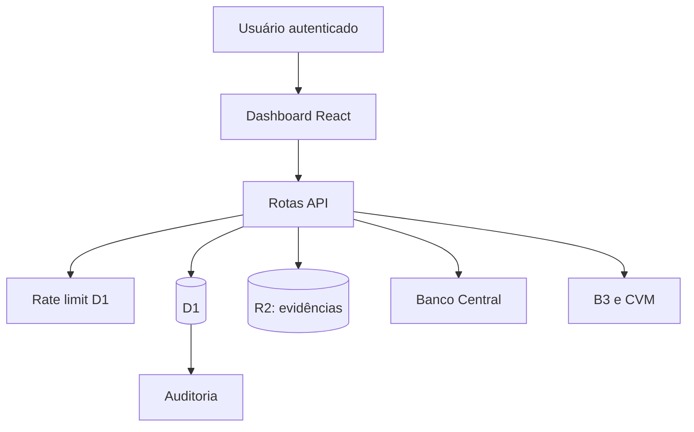

# Arquitetura executável do MVP

## Fonte da verdade atual

- arquivo original: R2, retenção operacional de 90 dias;
- lote e hash: `import_batches`;
- posição normalizada: `positions`;
- snapshot: `portfolio_snapshots`;
- câmbio: `fx_rates` e referência gravada no lote;
- ações sensíveis: `audit_logs`;
- contadores de proteção: `rate_limit_counters`.

Posições e snapshots ainda representam um recorte de posição atual. O ledger de eventos e pernas descrito no README permanece necessário antes de histórico completo, TWR e XIRR.
